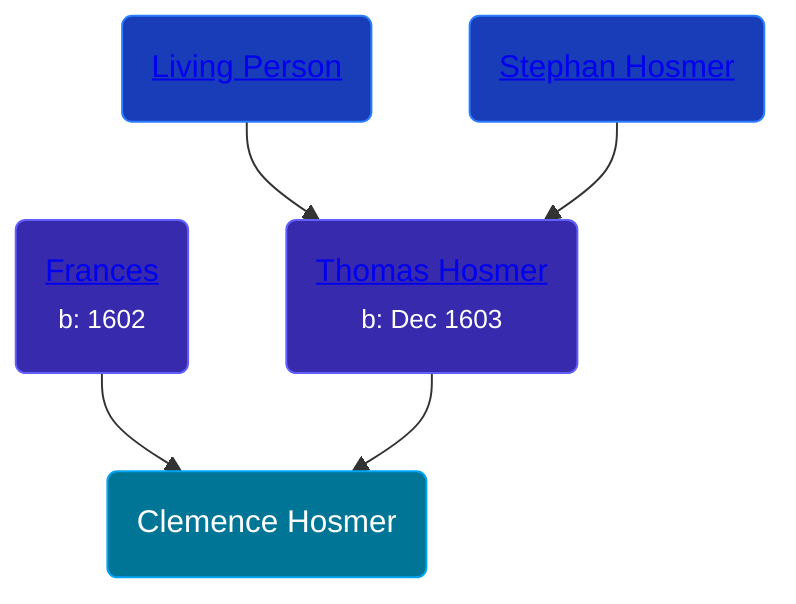

## 🟣 Clemence Hosmer
<small>Age: undefined</small>

Daughter of [Thomas Hosmer](/people/7/70805658) and [Frances ](/people/1/15178620)





### 📆 Events


Type | Date | Age at Event | Place
------ | ------ | ------ | ------
[Death](#event-event-2) | 1698 | undefined |



- **[Death](#event-event-2)**
**Date**: 1698, Age: undefined
**Place**:


### 📰 Event Sources

####  Death, 1698
* Genealogy of the Hosmer Family  - 4