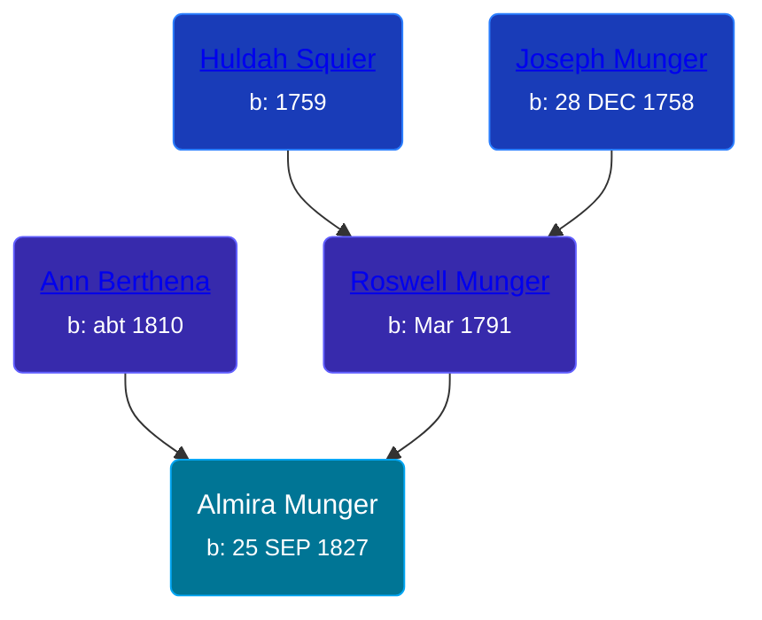

## 🟣 Almira Munger
<small>Age: 45y, 8m, 1d</small>

Daughter of [Roswell Munger](/people/2/21686617) and [Ann Berthena ](/people/9/91501676)





### 📆 Events


Type | Date | Age at Event | Place
------ | ------ | ------ | ------
Birth | 25 SEP 1827 |  | New York, USA
[Residence](#event-event-0) | 1850 | 22y, 2m, 5d | LaGrange, Lorain, Ohio, USA
[Residence](#event-event-1) | 28 JUN 1860 | 32y, 9m, 3d | Byron Township, Kent, Michigan, USA
[Residence](#event-event-2) | 16 AUG 1870 | 42y, 10m, 21d | Paris Township, Kent, Michigan, USA
Death | 26 MAY 1873 | 45y, 8m, 1d |
[Burial](#event-event-8) |  |  | Winchester Cemetery, Byron Township, Kent, Michigan, USA



- **Birth**
**Date**: 25 SEP 1827, Age:
**Place**: New York, USA
- **[Residence](#event-event-0)**
**Date**: 1850, Age: 22y, 2m, 5d
**Place**: LaGrange, Lorain, Ohio, USA
- **[Residence](#event-event-1)**
**Date**: 28 JUN 1860, Age: 32y, 9m, 3d
**Place**: Byron Township, Kent, Michigan, USA
- **[Residence](#event-event-2)**
**Date**: 16 AUG 1870, Age: 42y, 10m, 21d
**Place**: Paris Township, Kent, Michigan, USA
- **Death**
**Date**: 26 MAY 1873, Age: 45y, 8m, 1d
**Place**:
- **[Burial](#event-event-8)**
**Date**:
**Place**: Winchester Cemetery, Byron Township, Kent, Michigan, USA


## 👩‍❤️‍👨 Relationships

### 🔵 [Tillotson T. Terrell](/people/5/59687792), b. 04 MAR 1821

#### Events


Type | Date | Age at Event | Place
------ | ------ | ------ | ------
[Marriage](#event-family-0-event-0) | 28 MAY 1850 | 22y, 8m, 3d | Lorain, Ohio, USA



- **[Marriage](#event-family-0-event-0)**
**Date**: 28 MAY 1850, Age: 22y, 8m, 3d
**Place**: Lorain, Ohio, USA


#### Children With Tillotson T. Terrell
* 🔵 [Sherman A. Terrell](/people/6/61267132), b. 19 MAY 1851
* 🟣 [Rosetta Avrilla Terrell](/people/8/84698967), b. 08 JUL 1853
* 🔵 [Curtland Terrell](/people/4/47972604), b. Aug 1856
* 🔵 [Franklin T. Terrell](/people/1/12166472), b. 11 OCT 1860
### 📰 Event Sources

####  Residence, 1850
* 1850 US Census

####  Residence, 28 JUN 1860
* 1860 US Census

####  Residence, 16 AUG 1870
* 1870 US Census

####  Burial
* Winchester Cemetery
>   
  > Terrell, Almira  
  > w. of Tillotson; d. May 26, 1873; a. 45y 8m 1d

####  Marriage, 28 MAY 1850
* Ohio, County Marriages, 1774-1993
>   
  > Name: Tillotan Terrell  
  > Gender: Male  
  > Marriage Date: 23 May 1850  
  > Marriage Place: Lorain, Ohio, USA  
  > Spouse: Almira Menger  
  > Gender: Female  
  > Film Number: 000447523
