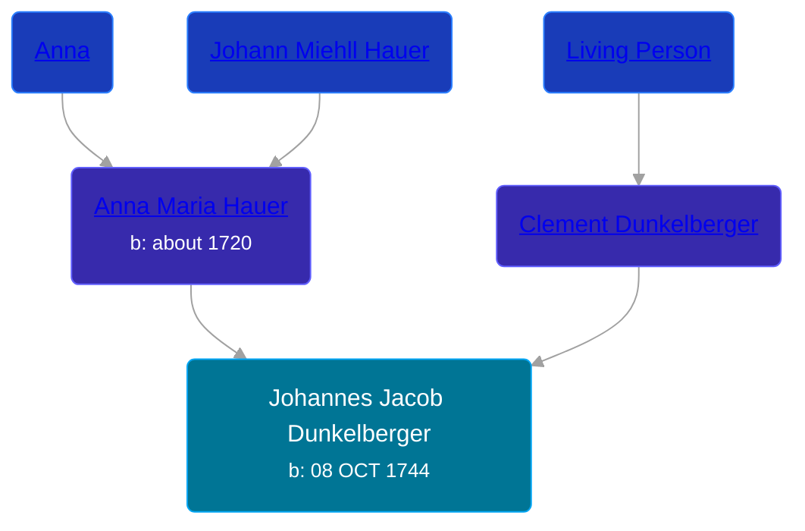

## 🔵 Johannes Jacob Dunkelberger
<small>Age: 74y, 1m, 19d</small>

Son of [Clement Dunkelberger](/people/1/13545057) and [Anna Maria Hauer](/people/2/22963774)





### 📆 Events


Type | Date | Age at Event | Place
------ | ------ | ------ | ------
[Birth](#event-event-2) | 08 OCT 1744 |  |
[Baptism](#event-event-0) | 28 SEP 1745 | 11m, 20d |
[Death](#event-event-4) | 27 NOV 1818 | 74y, 1m, 19d |



- **[Birth](#event-event-2)**
**Date**: 08 OCT 1744, Age:
**Place**:
- **[Baptism](#event-event-0)**
**Date**: 28 SEP 1745, Age: 11m, 20d
**Place**:
- **[Death](#event-event-4)**
**Date**: 27 NOV 1818, Age: 74y, 1m, 19d
**Place**:


## 👩‍❤️‍👨 Relationships

### 🟣 [Living Person](/people/2/28574928)

### 🟣 [Living Person](/people/7/71135297)

### 📰 Event Sources

####  Birth, 08 OCT 1744
* The Dunkelberger Family: Europe to America, 1600-1982

####  Baptism, 28 SEP 1745
* The Dunkelberger Family: Europe to America, 1600-1982

####  Death, 27 NOV 1818
* The Dunkelberger Family: Europe to America, 1600-1982