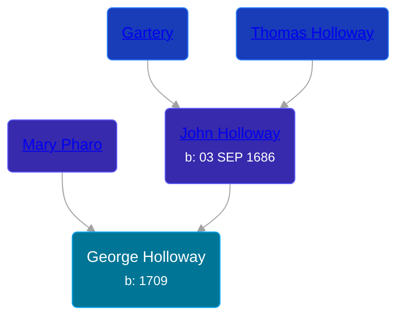

## 🔵 George Holloway

Son of [John Holloway](/people/9/96991309) and [Mary Pharo](/people/5/54110711)





### 📆 Events


Type | Date | Age at Event | Place
------ | ------ | ------ | ------
Birth | 1709 |  | Burlington, New Jersey, USA



- **Birth**
**Date**: 1709, Age:
**Place**: Burlington, New Jersey, USA


## 👩‍❤️‍👨 Relationships

### 🟣 [Ruth Wood](/people/9/93045664)

#### Events


Type | Date | Age at Event | Place
------ | ------ | ------ | ------
Marriage | 10 SEP 1731 | 22y, 9m, 10d | Springfield, New Jersey, USA



- **Marriage**
**Date**: 10 SEP 1731, Age: 22y, 9m, 10d
**Place**: Springfield, New Jersey, USA


#### Children With Ruth Wood
* 🔵 [Isaac Holloway](/people/9/97947565), b. 25 OCT 1735
### 📰 Event Sources

####  Marriage, 10 SEP 1731