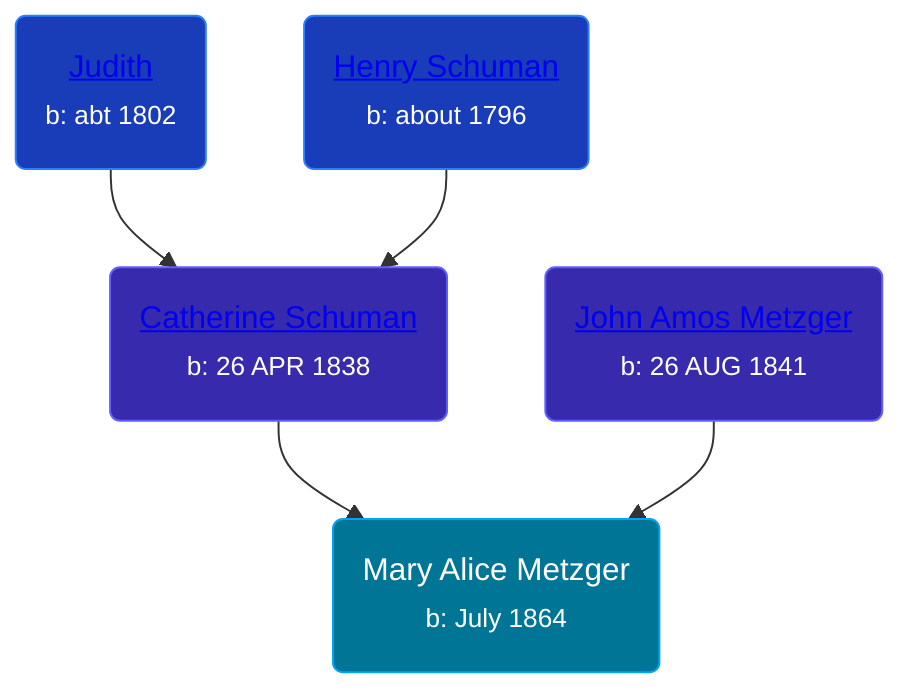

## 🟣 Mary Alice Metzger

Daughter of [John Amos Metzger](/people/2/28893894) and [Catherine Schuman](/people/3/39599940)





### 📆 Events


Type | Date | Age at Event | Place
------ | ------ | ------ | ------
Birth | July 1864 |  | Ohio, USA
[Residence](#event-event-0) | 1870 | 5y, 5m | Troy Township, Whitley, Indiana, USA
[Residence](#event-event-1) | 02 JUN 1900 | 35y, 11m, 2d | Chester Township, Wabash, Indiana, USA
[Residence](#event-event-2) | 03 MAY 1910 | 45y, 10m, 3d | North Manchester, Wabash, Indiana, USA
[Residence](#event-event-3) | 06 FEB 1920 | 55y, 7m, 6d | Columbia City, Whitley, Indiana, USA
[Residence](#event-event-4) | 16 APR 1930 | 65y, 9m, 16d | Columbia City, Whitley, Indiana, USA
[Residence](#event-event-5) | 15 APR 1940 | 75y, 9m, 15d | Columbia City, Whitley, Indiana, USA



- **Birth**
**Date**: July 1864, Age:
**Place**: Ohio, USA
- **[Residence](#event-event-0)**
**Date**: 1870, Age: 5y, 5m
**Place**: Troy Township, Whitley, Indiana, USA
- **[Residence](#event-event-1)**
**Date**: 02 JUN 1900, Age: 35y, 11m, 2d
**Place**: Chester Township, Wabash, Indiana, USA
- **[Residence](#event-event-2)**
**Date**: 03 MAY 1910, Age: 45y, 10m, 3d
**Place**: North Manchester, Wabash, Indiana, USA
- **[Residence](#event-event-3)**
**Date**: 06 FEB 1920, Age: 55y, 7m, 6d
**Place**: Columbia City, Whitley, Indiana, USA
- **[Residence](#event-event-4)**
**Date**: 16 APR 1930, Age: 65y, 9m, 16d
**Place**: Columbia City, Whitley, Indiana, USA
- **[Residence](#event-event-5)**
**Date**: 15 APR 1940, Age: 75y, 9m, 15d
**Place**: Columbia City, Whitley, Indiana, USA


## 👩‍❤️‍👨 Relationships

### 🔵 [Eli Thomas Spohn](/people/9/9010973), b. May 1859

#### Events


Type | Date | Age at Event | Place
------ | ------ | ------ | ------
[Marriage](#event-family-0-event-0) | 28 OCT 1884 | 20y, 3m, 28d | Whitley, Indiana, USA



- **[Marriage](#event-family-0-event-0)**
**Date**: 28 OCT 1884, Age: 20y, 3m, 28d
**Place**: Whitley, Indiana, USA


#### Children With Eli Thomas Spohn
* 🟣 [Mary E. Spohn](/people/9/97921888), b. Aug 1885
* 🔵 [Clarence W. Spohn](/people/6/64811370), b. 01 AUG 1889
### 📰 Event Sources

####  Residence, 1870
* 1870 US Census

####  Marriage, 28 OCT 1884
* Indiana, Select Marriages Index, 1748-1993
>   
  > Name:Mary Alice Mitzzer  
  > Gender:Female  
  > Birth Date:1863  
  > Marriage Date:28 Oct 1884  
  > Marriage Place:Whitley, Indiana  
  > Marriage Age:21y  
  > Father:John Mitzzer  
  > Mother:Catharine S.H...  
  > Spouse:Eli Thomas Spohn  
  > Gender:Male  
  > Birth Date:1858  
  > Marriage Age:26y  
  > Father:John Spohn  
  > Mother:Cyntha Pram  
  > FHL Film Number:1710719  
  > Reference ID:# 3

####  Residence, 02 JUN 1900
* 1900 US Census

####  Residence, 03 MAY 1910
* 1910 US Census

####  Residence, 06 FEB 1920
* 1920 US Census

####  Residence, 16 APR 1930
* 1930 US Census

####  Residence, 15 APR 1940
* 1940 US Census