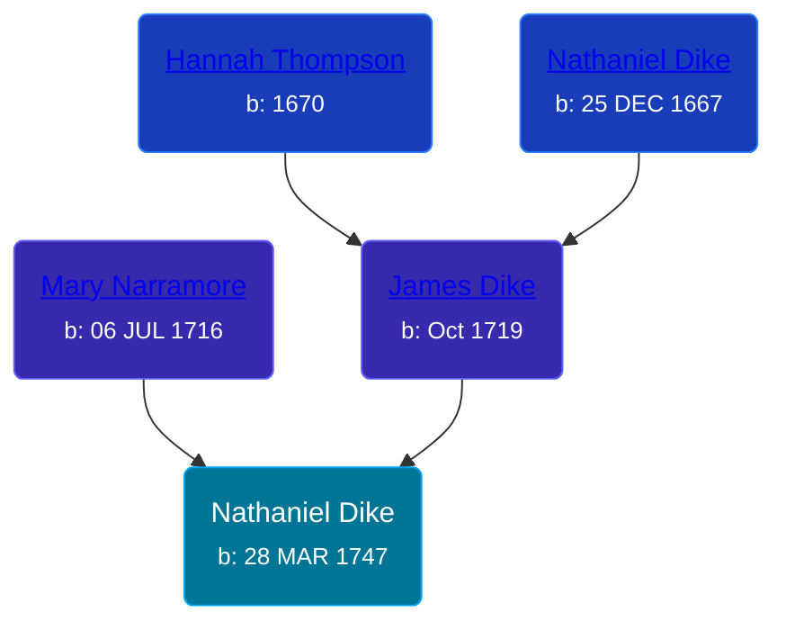

## 🔵 Nathaniel Dike
<small>Age: 65y, 8m, 2d</small>

Son of [James Dike](/people/2/20400692) and [Mary Narramore](/people/3/34713515)





### 📆 Events


Type | Date | Age at Event | Place
------ | ------ | ------ | ------
[Birth](#event-event-2) | 28 MAR 1747 |  | Killingly, Connecticut, USA
[Death](#event-event-3) | 1813 | 65y, 8m, 2d |



- **[Birth](#event-event-2)**
**Date**: 28 MAR 1747, Age:
**Place**: Killingly, Connecticut, USA
- **[Death](#event-event-3)**
**Date**: 1813, Age: 65y, 8m, 2d
**Place**:


## 👩‍❤️‍👨 Relationships

### 🟣 [Living Person](/people/6/66432130)

#### Children With Living Person
* 🔵 [Living Person](/people/3/3859108)
* 🔵 [James Dike](/people/4/45570704), b. 1776
* 🟣 [Phebe Percis Dike](/people/4/41577072), b. 1777
### 📰 Event Sources

####  Birth, 28 MAR 1747
* Patrick Wilson's Research

####  Death, 1813
* The Wellsville Story  - 21