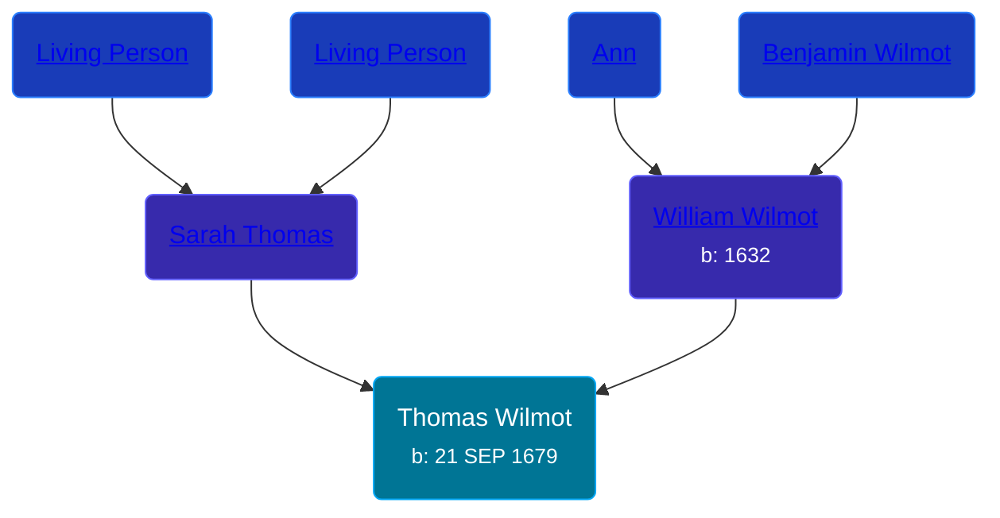

## 🔵 Thomas Wilmot

Son of [William Wilmot](/people/4/47205976) and [Sarah Thomas](/people/2/28506175)





### 📆 Events


Type | Date | Age at Event | Place
------ | ------ | ------ | ------
[Birth](#event-event-2) | 21 SEP 1679 |  |



- **[Birth](#event-event-2)**
**Date**: 21 SEP 1679, Age:
**Place**:


## 👩‍❤️‍👨 Relationships

### 🟣 [Living Person](/people/6/642264)

#### Children With Living Person
* 🟣 [Mary Wilmot](/people/6/63055620), b. 24 AUG 1725
### 🟣 [Living Person](/people/1/19292651)

#### Children With Living Person
* 🔵 [William Wilmot](/people/7/75329141), b. 04 MAY 1706
* 🔵 [Ezekiel Wilmot](/people/7/74243487), b. 15 FEB 1708
* 🔵 [Daniel Wilmot](/people/1/15714816), b. 26 MAY 1710
* 🔵 [Thomas Wilmot](/people/5/57007378), b. 25 AUG 1712
* 🔵 [Asa Wilmot](/people/1/15735504), b. 11 APR 1716
### 📰 Event Sources

####  Birth, 21 SEP 1679
* The New England Historical and Genealogical Register  - 68