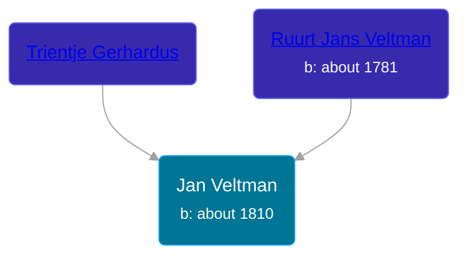

## 🔵 Jan Veltman
<small>Age: 77y, 1m, 3d</small>

Son of [Ruurt Jans Veltman](/people/5/53462276) and [Trientje Gerhardus](/people/5/5258118)





### 📆 Events


Type | Date | Age at Event | Place
------ | ------ | ------ | ------
Birth | about 1810 |  |
[Death](#event-event-3) | 03 JAN 1887 | 77y, 1m, 3d | Grootegast, Netherlands



- **Birth**
**Date**: about 1810, Age:
**Place**:
- **[Death](#event-event-3)**
**Date**: 03 JAN 1887, Age: 77y, 1m, 3d
**Place**: Grootegast, Netherlands


### 📰 Event Sources

####  Death, 03 JAN 1887
* Dutch Civil Register
>   
  > Source Civil register - Death  
  > Archive location: Groninger Archieven  
  > General Municipality: Grootegast  
  > Type of record: overlijden  
  > Record number: 1  
  > Registration date: 04-01-1887  
  > Deceased: Jan Veltman  
  > Gender: M  
  > Date of death: 03-01-1887  
  > Age: 77  
  > Place of death: Grootegast  
  > Father: Ruurt Jans Veltman  
  > Mother: Trijntje Gerardus de Vries  
  > Partner: Jantje Oosterhuis  
  > Relationship: weduwnaar  
  > Additional information: geboortepl: Leek; beroep overl.: landbouwer
