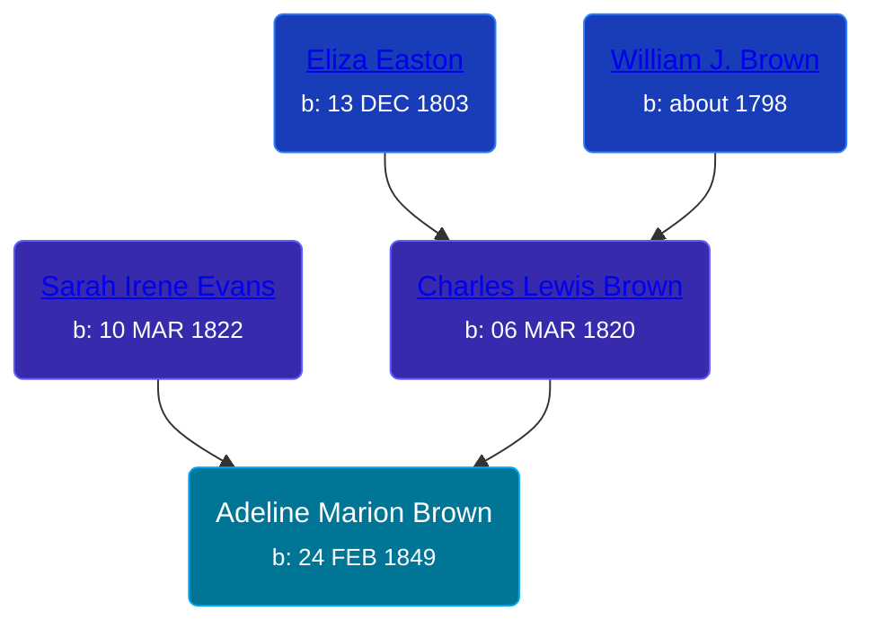

## 🟣 Adeline Marion Brown
<small>Age: 70y, 9m, 9d</small>

Daughter of [Charles Lewis Brown](/people/7/70538697) and [Sarah Irene Evans](/people/4/47294572)





### 📆 Events


Type | Date | Age at Event | Place
------ | ------ | ------ | ------
Birth | 24 FEB 1849 |  | Michigan, USA
Death | 03 DEC 1919 | 70y, 9m, 9d | Deerfield Township, Isabella, Michigan, USA



- **Birth**
**Date**: 24 FEB 1849, Age:
**Place**: Michigan, USA
- **Death**
**Date**: 03 DEC 1919, Age: 70y, 9m, 9d
**Place**: Deerfield Township, Isabella, Michigan, USA


## 👩‍❤️‍👨 Relationships

### 🔵 [Levi David Kobel](/people/5/56833508), b. 10 JAN 1870
