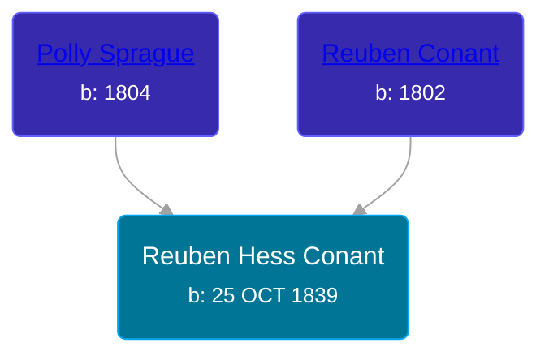

## 🔵 Reuben Hess Conant
<small>Age: 73y, 7m, 21d</small>

Son of [Reuben Conant](/people/7/72221832) and [Polly Sprague](/people/5/53927626)





### 📆 Events


Type | Date | Age at Event | Place
------ | ------ | ------ | ------
Birth | 25 OCT 1839 |  | New York, USA
[Residence](#event-event-0) | 30 SEP 1850 | 10y, 11m, 5d | Savannah, Wayne, New York, USA
[Residence](#event-event-1) | 06 JUL 1860 | 20y, 8m, 11d | Savannah, Wayne, New York, USA
[Residence](#event-event-2) | June 1880 | 40y, 7m, 5d | Robinson Township, Ottawa, Michigan, USA
[Residence](#event-event-3) | 05 JUN 1900 | 60y, 7m, 10d | Robinson Township, Ottawa, Michigan, USA
[Residence](#event-event-4) | 09 APR 1910 | 70y, 5m, 14d | Grand Haven, Ottawa, Michigan, USA
[Death](#event-event-8) | 16 JUN 1913 | 73y, 7m, 21d | Grand Haven, Ottawa, Michigan, USA
[Burial](#event-event-9) |  |  | Robinson Township Cemetery, Robinson Township, Ottawa, Michigan, USA



- **Birth**
**Date**: 25 OCT 1839, Age:
**Place**: New York, USA
- **[Residence](#event-event-0)**
**Date**: 30 SEP 1850, Age: 10y, 11m, 5d
**Place**: Savannah, Wayne, New York, USA
- **[Residence](#event-event-1)**
**Date**: 06 JUL 1860, Age: 20y, 8m, 11d
**Place**: Savannah, Wayne, New York, USA
- **[Residence](#event-event-2)**
**Date**: June 1880, Age: 40y, 7m, 5d
**Place**: Robinson Township, Ottawa, Michigan, USA
- **[Residence](#event-event-3)**
**Date**: 05 JUN 1900, Age: 60y, 7m, 10d
**Place**: Robinson Township, Ottawa, Michigan, USA
- **[Residence](#event-event-4)**
**Date**: 09 APR 1910, Age: 70y, 5m, 14d
**Place**: Grand Haven, Ottawa, Michigan, USA
- **[Death](#event-event-8)**
**Date**: 16 JUN 1913, Age: 73y, 7m, 21d
**Place**: Grand Haven, Ottawa, Michigan, USA
- **[Burial](#event-event-9)**
**Date**:
**Place**: Robinson Township Cemetery, Robinson Township, Ottawa, Michigan, USA


## 👩‍❤️‍👨 Relationships

### 🟣 [Alveretta V. Conant](/people/6/60109856), b. 31 MAY 1854

#### Events


Type | Date | Age at Event | Place
------ | ------ | ------ | ------
Marriage | 1874 | 34y, 1m, 5d |



- **Marriage**
**Date**: 1874, Age: 34y, 1m, 5d
**Place**:


#### Children With Alveretta V. Conant
* 🔵 [Nelson H. Conant](/people/9/90473988), b. 17 AUG 1874
* 🟣 [Cora Mabel Conant](/people/7/75623980), b. 22 NOV 1876
* 🔵 [George Truman Conant](/people/5/50624075), b. about 1878
* 🔵 [Ernest Conant](/people/4/4994264), b. Jan 1881
* 🟣 [Lulu Conant](/people/6/66371832), b. May 1886
* 🟣 [Wanda Conant](/people/3/3340870), b. Nov 1891
### 📰 Event Sources

####  Residence, 30 SEP 1850
* 1850 US Census
>   
  > Name: Reuben S Conant  
  > Gender: Male  
  > Race: White  
  > Residence Age: 10  
  > Birth Date: abt 1840  
  > Birthplace: New York  
  > Residence Date: 1850  
  > Home in 1850: Savannah, Wayne, New York, USA  
  > Attended School: Yes  
  > Line Number: 34  
  > Dwelling Number: 264  
  > Family Number: 264  
  >   
  > Household members:  
  > Reuben Conant, 47  
  > Polly Conant, 45  
  > Sally A Conant, 15  
  > Reuben S Conant, 10  
  > James Conant, 6  
  > Edwin Wilson, 21  
  > Mary Wilson, 18

####  Residence, 06 JUL 1860
* 1860 US Census

####  Residence, June 1880
* 1880 US Census

####  Residence, 05 JUN 1900
* 1900 US Census

####  Residence, 09 APR 1910
* 1910 US Census

####  Death, 16 JUN 1913
* Michigan, Death Records, 1867-1950
>   
  > Name:Ruben H Conant  
  > Birth Year:1839  
  > Death Date:16 Jun 1913  
  > Death Place:Grand Haven, Ottawa, Michigan, USA  
  > Age:73  
  > Father's name:Ruben Conant

####  Burial
* findagrave.com

####  Marriage, 1874