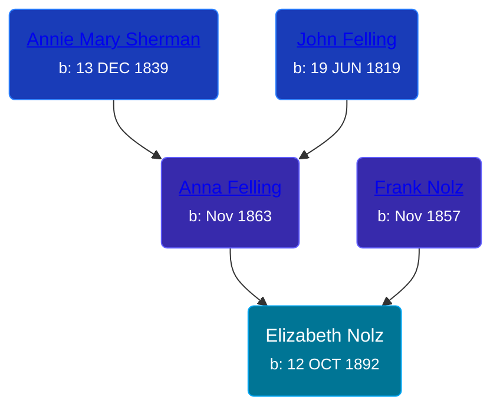

## 🟣 Elizabeth Nolz
<small>Age: 71y, 5m, 13d</small>

Daughter of [Frank Nolz](/people/6/61628928) and [Anna Felling](/people/1/1735561)





### 📆 Events


Type | Date | Age at Event | Place
------ | ------ | ------ | ------
[Birth](#event-event-3) | 12 OCT 1892 |  | Ramsey, Minnesota, USA
[Residence](#event-event-0) | 12 JUN 1895 | 2y, 8m | St Paul, Ramsey, Minnesota, USA
[Residence](#event-event-1) | 06 JUN 1900 | 7y, 7m, 24d | St Paul, Ramsey, Minnesota, USA
[Residence](#event-event-2) | 02 MAY 1910 | 17y, 6m, 20d | St Paul, Ramsey, Minnesota, USA
[Residence](#event-event-3) | 08 JAN 1920 | 27y, 2m, 26d | St Paul, Ramsey, Minnesota, USA
[Residence](#event-event-4) | 12 APR 1930 | 37y, 6m | Grand Rapids, Kent, Michigan, United States
[Residence](#event-event-5) | 13 APR 1940 | 47y, 6m, 1d | Grand Rapids, Kent, Michigan, United States
Death | 25 MAR 1964 | 71y, 5m, 13d |
[Burial](#event-event-11) |  |  | Resurrection Cemetery, Wyoming, Kent, Michigan, USA



- **[Birth](#event-event-3)**
**Date**: 12 OCT 1892, Age:
**Place**: Ramsey, Minnesota, USA
- **[Residence](#event-event-0)**
**Date**: 12 JUN 1895, Age: 2y, 8m
**Place**: St Paul, Ramsey, Minnesota, USA
- **[Residence](#event-event-1)**
**Date**: 06 JUN 1900, Age: 7y, 7m, 24d
**Place**: St Paul, Ramsey, Minnesota, USA
- **[Residence](#event-event-2)**
**Date**: 02 MAY 1910, Age: 17y, 6m, 20d
**Place**: St Paul, Ramsey, Minnesota, USA
- **[Residence](#event-event-3)**
**Date**: 08 JAN 1920, Age: 27y, 2m, 26d
**Place**: St Paul, Ramsey, Minnesota, USA
- **[Residence](#event-event-4)**
**Date**: 12 APR 1930, Age: 37y, 6m
**Place**: Grand Rapids, Kent, Michigan, United States
- **[Residence](#event-event-5)**
**Date**: 13 APR 1940, Age: 47y, 6m, 1d
**Place**: Grand Rapids, Kent, Michigan, United States
- **Death**
**Date**: 25 MAR 1964, Age: 71y, 5m, 13d
**Place**:
- **[Burial](#event-event-11)**
**Date**:
**Place**: Resurrection Cemetery, Wyoming, Kent, Michigan, USA


## 👩‍❤️‍👨 Relationships

### 🔵 [Joseph DeLonais](/people/7/72748828), b. 25 OCT 1888

#### Events


Type | Date | Age at Event | Place
------ | ------ | ------ | ------
[Marriage](#event-family-0-event-0) | 17 JUN 1913 | 20y, 8m, 5d | St Paul, Ramsey, Minnesota, USA



- **[Marriage](#event-family-0-event-0)**
**Date**: 17 JUN 1913, Age: 20y, 8m, 5d
**Place**: St Paul, Ramsey, Minnesota, USA


#### Children With Joseph DeLonais
* 🔵 [Living Person](/people/5/58119852)
* 🟣 [Mary Ann DeLonais](/people/3/38006988), b. 15 FEB 1916
* 🟣 [Living Person](/people/7/73613194)
* 🟣 [Eleanore H. DeLonais](/people/4/45463626), b. 10 NOV 1932
### 📰 Event Sources

####  Birth, 12 OCT 1892
* Minnesota, Marriages Index, 1849-1950

####  Residence, 12 JUN 1895
* 1895 Minnesota State Census

####  Residence, 06 JUN 1900
* 1900 US Census

####  Residence, 02 MAY 1910
* 1910 US Census

####  Residence, 08 JAN 1920
* 1920 US Census

####  Residence, 12 APR 1930
* 1930 US Census

####  Residence, 13 APR 1940
* 1940 US Census

####  Burial
* findagrave.com

####  Marriage, 17 JUN 1913
* Minnesota, Marriages Index, 1849-1950
>   
  > Name: Joseph Delonais  
  > Gender: Male  
  > Birth Place: Ramsey, Minnesota  
  > Marriage Date: 17 Jun 1913  
  > Marriage Place: St Paul, Ramsey, Minnesota  
  > Spouse's Name: Elizabeth Nolz  
  > Spouse Gender: Female  
  > Spouse Birth Place: Ramsey, Minnesota  
  > Event Type: Marriage  
  > FHL Film Number: 1313420