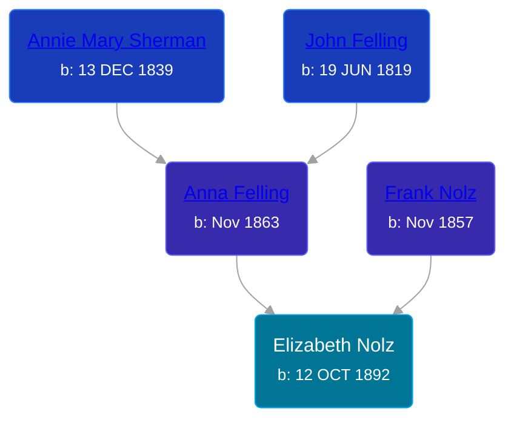

## 🟣 Elizabeth Nolz
<small>Age: 71y, 5m, 13d</small>

Daughter of [Frank Nolz](/people/6/61628928) and [Anna Felling](/people/1/1735561)



```mermaid
graph
classDef grands fill:#193cb8,stroke:#2b7fff,stroke-width:1px,color:#fff;
classDef parents fill:#372aac,stroke:#615fff,stroke-width:1px,color:#fff;
classDef primary fill:#007595,stroke:#00a6f4,stroke-width:1px,color:#fff;
37387446(Elizabeth Nolz<br /><small>b: 12 OCT 1892</small>):::primary
1735561(<a class="text-white" href="/people/1/1735561">Anna Felling</a><br /><small>b: Nov 1863</small>):::parents-->37387446
35774638(<a class="text-white" href="/people/3/35774638">Annie Mary Sherman</a><br /><small>b: 13 DEC 1839</small>):::grands-->1735561
83711573(<a class="text-white" href="/people/8/83711573">John Felling</a><br /><small>b: 19 JUN 1819</small>):::grands-->1735561
61628928(<a class="text-white" href="/people/6/61628928">Frank Nolz</a><br /><small>b: Nov 1857</small>):::parents-->37387446
linkStyle default stroke:#a1a1a1
```


### 📆 Events


Type | Date | Age at Event | Place
------ | ------ | ------ | ------
[Birth](#event-event-0) | 12 OCT 1892 |  | Ramsey, Minnesota, USA
[Residence](#event-event-1) | 12 JUN 1895 | 2y, 8m | St Paul, Ramsey, Minnesota, USA
[Residence](#event-event-2) | 06 JUN 1900 | 7y, 7m, 25d | St Paul, Ramsey, Minnesota, USA
[Residence](#event-event-3) | 02 MAY 1910 | 17y, 6m, 20d | St Paul, Ramsey, Minnesota, USA
[Residence](#event-event-4) | 08 JAN 1920 | 27y, 2m, 27d | St Paul, Ramsey, Minnesota, USA
[Residence](#event-event-5) | 12 APR 1930 | 37y, 6m | Grand Rapids, Kent, Michigan, United States
[Residence](#event-event-6) | 13 APR 1940 | 47y, 6m, 1d | Grand Rapids, Kent, Michigan, United States
[Residence](#event-event-7) | 06 APR 1950 | 57y, 5m, 25d | Grand Rapids, Kent, Michigan, United States
Death | 25 MAR 1964 | 71y, 5m, 13d |
[Burial](#event-event-9) |  |  | Resurrection Cemetery, Wyoming, Kent, Michigan, USA



- **[Birth](#event-event-0)**
**Date**: 12 OCT 1892, Age:
**Place**: Ramsey, Minnesota, USA
- **[Residence](#event-event-1)**
**Date**: 12 JUN 1895, Age: 2y, 8m
**Place**: St Paul, Ramsey, Minnesota, USA
- **[Residence](#event-event-2)**
**Date**: 06 JUN 1900, Age: 7y, 7m, 25d
**Place**: St Paul, Ramsey, Minnesota, USA
- **[Residence](#event-event-3)**
**Date**: 02 MAY 1910, Age: 17y, 6m, 20d
**Place**: St Paul, Ramsey, Minnesota, USA
- **[Residence](#event-event-4)**
**Date**: 08 JAN 1920, Age: 27y, 2m, 27d
**Place**: St Paul, Ramsey, Minnesota, USA
- **[Residence](#event-event-5)**
**Date**: 12 APR 1930, Age: 37y, 6m
**Place**: Grand Rapids, Kent, Michigan, United States
- **[Residence](#event-event-6)**
**Date**: 13 APR 1940, Age: 47y, 6m, 1d
**Place**: Grand Rapids, Kent, Michigan, United States
- **[Residence](#event-event-7)**
**Date**: 06 APR 1950, Age: 57y, 5m, 25d
**Place**: Grand Rapids, Kent, Michigan, United States
- **Death**
**Date**: 25 MAR 1964, Age: 71y, 5m, 13d
**Place**:
- **[Burial](#event-event-9)**
**Date**:
**Place**: Resurrection Cemetery, Wyoming, Kent, Michigan, USA


## 👩‍❤️‍👨 Relationships

### 🔵 [Joseph DeLonais](/people/7/72748828), b. 25 OCT 1888

#### Events


Type | Date | Age at Event | Place
------ | ------ | ------ | ------
[Marriage](#event-family-0-event-0) | 17 JUN 1913 | 20y, 8m, 5d | St Paul, Ramsey, Minnesota, USA



- **[Marriage](#event-family-0-event-0)**
**Date**: 17 JUN 1913, Age: 20y, 8m, 5d
**Place**: St Paul, Ramsey, Minnesota, USA


#### Children With Joseph DeLonais
* 🔵 [Living Person](/people/5/58119852)
* 🟣 [Mary Ann DeLonais](/people/3/38006988), b. 15 FEB 1916
* 🟣 [Living Person](/people/7/73613194)
* 🟣 [Eleanore Helen DeLonais](/people/4/45463626), b. 10 NOV 1932
### 📰 Event Sources

####  Birth, 12 OCT 1892
* Minnesota, Marriages Index, 1849-1950

####  Residence, 12 JUN 1895
* 1895 Minnesota State Census

####  Residence, 06 JUN 1900
* 1900 US Census

####  Residence, 02 MAY 1910
* 1910 US Census

####  Residence, 08 JAN 1920
* 1920 US Census

####  Residence, 12 APR 1930
* 1930 US Census

####  Residence, 13 APR 1940
* 1940 US Census

####  Residence, 06 APR 1950
* 1950 US Census
>
  > Name: Elizabeth Delonais
  > Age: 56
  > Birth Date: abt 1894
  > Gender: Female
  > Race: White
  > Birth Place: Minnesota
  > Marital Status: Married
  > Relation to Head of House: Wife
  > Residence Date: 1950
  > Home in 1950: Grand Rapids, Kent, Michigan, USA
  > Street Name: La Belle St
  > House Number: 30
  > Dwelling Number: 136
  > Farm: No
  > Acres: No
  > Occupation Category: Keeping House
  > Worked Last Week: No
  > Seeking Work: No
  > Employment Status: No
  >
  > Household Members
  > Joseph Delonais, 60, Head
  > Elizabeth Delonais, 56, Wife
  > Eleanor Delonais, 17, Daughter
  > Joseph Delonais, 36, Son

####  Burial
* findagrave.com

####  Marriage, 17 JUN 1913
* Minnesota, Marriages Index, 1849-1950
>
  > Name: Joseph Delonais
  > Gender: Male
  > Birth Place: Ramsey, Minnesota
  > Marriage Date: 17 Jun 1913
  > Marriage Place: St Paul, Ramsey, Minnesota
  > Spouse's Name: Elizabeth Nolz
  > Spouse Gender: Female
  > Spouse Birth Place: Ramsey, Minnesota
  > Event Type: Marriage
  > FHL Film Number: 1313420
