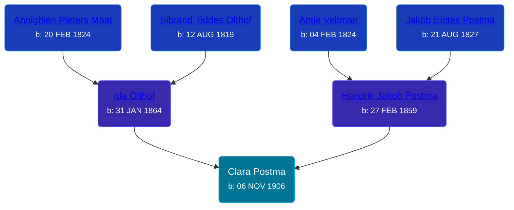

## 🟣 Clara Postma
<small>Age: 77y, 4m</small>

Daughter of [Hendrik Jakob Postma](/people/3/31727152) and [Ida Olthof](/people/6/60020862)





### 📆 Events


Type | Date | Age at Event | Place
------ | ------ | ------ | ------
[Birth](#event-event-2) | 06 NOV 1906 |  | Gaines Township, Kent, Michigan, USA
[Residence](#event-event-0) | 1910 | 3y, 24d | Gaines Township, Kent, Michigan, USA
[Residence](#event-event-1) | 14 JAN 1920 | 13y, 2m, 8d | Gaines Township, Kent, Michigan, USA
[Residence](#event-event-2) | 24 APR 1930 | 23y, 5m, 18d | Gaines Township, Kent, Michigan, USA
[Death](#event-event-6) | 06 MAR 1984 | 77y, 4m | Grand Rapids, Kent, Michigan, United States
[Burial](#event-event-7) | 10 MAR 1984 | 77y, 4m, 4d | Pine Hill Cemetery, Kentwood, Kent, Michigan, USA



- **[Birth](#event-event-2)**
**Date**: 06 NOV 1906, Age:
**Place**: Gaines Township, Kent, Michigan, USA
- **[Residence](#event-event-0)**
**Date**: 1910, Age: 3y, 24d
**Place**: Gaines Township, Kent, Michigan, USA
- **[Residence](#event-event-1)**
**Date**: 14 JAN 1920, Age: 13y, 2m, 8d
**Place**: Gaines Township, Kent, Michigan, USA
- **[Residence](#event-event-2)**
**Date**: 24 APR 1930, Age: 23y, 5m, 18d
**Place**: Gaines Township, Kent, Michigan, USA
- **[Death](#event-event-6)**
**Date**: 06 MAR 1984, Age: 77y, 4m
**Place**: Grand Rapids, Kent, Michigan, United States
- **[Burial](#event-event-7)**
**Date**: 10 MAR 1984, Age: 77y, 4m, 4d
**Place**: Pine Hill Cemetery, Kentwood, Kent, Michigan, USA


### 📰 Event Sources

####  Birth, 06 NOV 1906
* Michigan, U.S., Birth Records, 1867-1914
>   
  > Name: Clara Postema   
  > Gender: Female   
  > Birth Date: 6 Nov 1906   
  > Birth Place: Gaines, Michigan, USA   
  > Father: Henry Postema   
  > Mother: Ida Olthof  
  > Jurisdiction Number: 421-670   
  > Reference Number: Vol 27C   
  >

####  Residence, 1910
* 1910 US Census

####  Residence, 14 JAN 1920
* 1920 US Census

####  Residence, 24 APR 1930
* 1930 US Census

####  Death, 06 MAR 1984
* Michigan Deaths, 1971-1996
>   
  > Name:  Clara Slager  
  > Birth Date: 6 Nov 1906  
  > Death Date: 6 Mar 1984  
  > Gender: Female  
  > Residence: Wyoming, Kent, Michigan  
  > Place of Death: Grand Rapids, Kent, Michigan
* U.S., Social Security Death Index, 1935-2014
>   
  > Name: Clara Slager  
  > Last Residence: 49508 Grand Rapids, Kent, Michigan, USA  
  > BORN: 6 Nov 1906  
  > Last Benefit: 49508, Grand Rapids, Kent, Michigan, United States of America  
  > Died: Mar 1984  
  > State (Year) SSN issued: Michigan (1951-1952)
* The Grand Rapids Press  - 7 Mar 1984
>   
  > SLAGER -- Mrs. Clara Slager, aged 77, of Wyoming, passed away Tuesday,March 6, 1984 at Kent Community Hospital. Surviving are her husband, William; a son, Henry Goeman of CA.; a daughter, Betty Fewless of Wyoming; a grandson, James; two brothers, Peter and his wife, Elizabeth Postma of Wyoming, Charles Postma of Grand Rapids; a sister-in-law, Mrs.Ida Postma of Kentwood; several nieces and nephews. Funeral services will be held Saturday at 1:30pm in Home Acres Reformed Church, with her Pastor the Rev. Gordon Waddilove officiating. Interment Pine Hill Cemeter.

####  Burial, 10 MAR 1984
* Pine Hill Cemetery, Personal Visit
>   
  > Goeman-Slager, Clara  
  > b: 1906; d: 1984