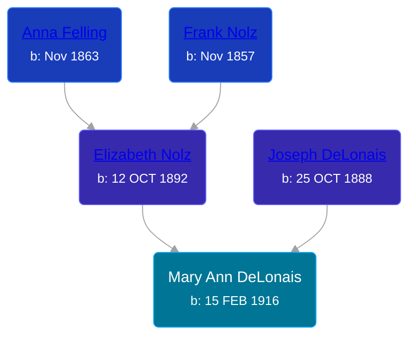

## 🟣 Mary Ann DeLonais
<small>Age: 95y, 3m, 27d</small>

Daughter of [Joseph DeLonais](/people/7/72748828) and [Elizabeth Nolz](/people/3/37387446)





### 📆 Events


Type | Date | Age at Event | Place
------ | ------ | ------ | ------
[Birth](#event-event-2) | 15 FEB 1916 |  | Ramsey, Minnesota, USA
[Residence](#event-event-0) | 08 JAN 1920 | 3y, 10m, 23d | St Paul, Ramsey, Minnesota, USA
[Residence](#event-event-1) | 12 APR 1930 | 14y, 1m, 27d | Grand Rapids, Kent, Michigan, United States
[Residence](#event-event-2) | 22 APR 1940 | 24y, 2m, 7d | Kellogsville, Kent, Michigan, USA
[Death](#event-event-6) | 12 JUN 2011 | 95y, 3m, 27d |
[Burial](#event-event-7) |  |  | Resurrection Cemetery, Wyoming, Kent, Michigan, USA



- **[Birth](#event-event-2)**
**Date**: 15 FEB 1916, Age:
**Place**: Ramsey, Minnesota, USA
- **[Residence](#event-event-0)**
**Date**: 08 JAN 1920, Age: 3y, 10m, 23d
**Place**: St Paul, Ramsey, Minnesota, USA
- **[Residence](#event-event-1)**
**Date**: 12 APR 1930, Age: 14y, 1m, 27d
**Place**: Grand Rapids, Kent, Michigan, United States
- **[Residence](#event-event-2)**
**Date**: 22 APR 1940, Age: 24y, 2m, 7d
**Place**: Kellogsville, Kent, Michigan, USA
- **[Death](#event-event-6)**
**Date**: 12 JUN 2011, Age: 95y, 3m, 27d
**Place**:
- **[Burial](#event-event-7)**
**Date**:
**Place**: Resurrection Cemetery, Wyoming, Kent, Michigan, USA


## 👩‍❤️‍👨 Relationships

### 🔵 [Earl Edwin Jourden](/people/9/93806660), b. 10 NOV 1914

#### Events


Type | Date | Age at Event | Place
------ | ------ | ------ | ------
[Marriage](#event-family-0-event-0) | 17 JUN 1937 | 21y, 4m, 2d | Grand Rapids, Kent, Michigan, United States



- **[Marriage](#event-family-0-event-0)**
**Date**: 17 JUN 1937, Age: 21y, 4m, 2d
**Place**: Grand Rapids, Kent, Michigan, United States


### 📰 Event Sources

####  Birth, 15 FEB 1916
* Minnesota, Birth Index, 1900-1934

####  Residence, 08 JAN 1920
* 1920 US Census

####  Residence, 12 APR 1930
* 1930 US Census

####  Residence, 22 APR 1940
* 1940 US Census

####  Death, 12 JUN 2011
* The Grand Rapids Press
>   
  > JOURDEN - Mary Ann Jourden, age 95, of Wyoming, was welcomed home by her Lord on Sunday, June 12, 2011. She was preceded in death by her husband, Earl; daughter, Mary Stolcenberg. Surviving are her children, Earl and Delilah Jourden, Robert Jourden, Roger Jourden, Steven Jourden, Carol and Harold Shepard, Marcia and Paul Thieme; 20 grandchildren; several great-grandchildren and great great-grandchildren; sister, Eleanore and Gerald Mahoney; many nieces and nephews. The family would like to say a very special thank you to the staff of Tendercare of Wyoming for all your support, loving comfort and care to Mary Ann. The Mass of Christian Burial will be celebrated Thursday 11 a.m. at St. John Vianney Church, 4101 Clyde Park SW with Fr. Mike Alber presiding. Interment Resurrection Cemetery. The family will receive relatives and friends Wednesday 2 to 4 and 7 to 9 p.m. at the Matthysse Kuiper DeGraaf Funeral Home, 4031 Clyde Park SW, Wyoming with a rosary service at 8:30 p.m. Memorial donations may be made to a charity of one's choice. Condolences may be sent on-line at www.mkdfuneralhome.com Matthysse Kuiper DeGraaf

####  Burial
* findagrave.com
>   
  > https://www.findagrave.com/memorial/106557995/mary-ann-jourden  
  >   
  > Mary Ann Jourden  
  > Feb. 15, 1916  
  > June 12, 2011
####  Marriage, 17 JUN 1937
* Michigan, Marriage Records, 1867-1952
>   
  > Name: Mary Ann DeLonais  
  > Gender: Female  
  > Race: White  
  > Birth Year: abt 1916  
  > Birth Place: St Paul, Minnesota  
  > Marriage Date: 17 Jun 1937  
  > Marriage Place: Grand Rapids, Kent, Michigan, USA  
  > License County: Kent  
  > Age: 21  
  > Father: Joseph DeLonais  
  > Mother: Elizabeth Nolz  
  > Spouse: Mr Earl Edwin Jourden  
  > Spouse Gender: Male  
  > Spouse Race: White  
  > Spouse Birth Place: Grand Rapids, Michigan  
  > Spouse Father: George Jourden  
  > Spouse Mother: Minnie Washburn  
  > County File Number: 284  
  > State File Number: 41 19096  
  > Film: 115  
  > Film Title: 41 Kent 19030-22319  
  > Film Description: Kent (1937 - 1939)
