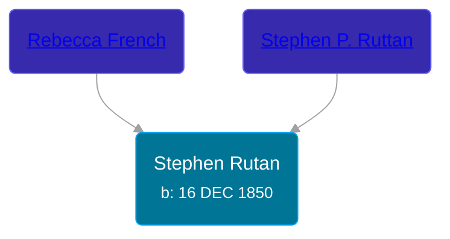

## 🔵 Stephen Rutan
<small>Age: 76y, 5m, 17d</small>

Son of [Stephen P. Ruttan](/people/7/79030672) and [Rebecca French](/people/9/96043941)





### 📆 Events


Type | Date | Age at Event | Place
------ | ------ | ------ | ------
Birth | 16 DEC 1850 |  | Pennsylvania, USA
[Residence](#event-event-1) | 04 JUN 1880 | 29y, 5m, 18d | Somerset Township, Hillsdale, Michigan, USA
[Death](#event-event-2) | 03 JUN 1927 | 76y, 5m, 17d | Somerset Township, Hillsdale, Michigan, USA



- **Birth**
**Date**: 16 DEC 1850, Age:
**Place**: Pennsylvania, USA
- **[Residence](#event-event-1)**
**Date**: 04 JUN 1880, Age: 29y, 5m, 18d
**Place**: Somerset Township, Hillsdale, Michigan, USA
- **[Death](#event-event-2)**
**Date**: 03 JUN 1927, Age: 76y, 5m, 17d
**Place**: Somerset Township, Hillsdale, Michigan, USA


## 👩‍❤️‍👨 Relationships

### 🟣 [Nancy ](/people/2/21074596), b. abt 1845

#### Events


Type | Date | Age at Event | Place
------ | ------ | ------ | ------
[Marriage](#event-family-0-event-0) | 03 DEC 1871 | 20y, 11m, 17d | Columbia, Jackson, Michigan, USA



- **[Marriage](#event-family-0-event-0)**
**Date**: 03 DEC 1871, Age: 20y, 11m, 17d
**Place**: Columbia, Jackson, Michigan, USA


#### Children With Nancy
* 🔵 [David M. Rutan](/people/3/34035104), b. abt 1875
* 🔵 [Stephen Rutan](/people/6/60950892), b. abt 1878
* 🔵 [Earl Rutan](/people/2/29949376), b. 09 AUG 1879
### 📰 Event Sources

####  Marriage, 03 DEC 1871
* Michigan, U.S., County Marriage Records, 1822-1940
>
  > Name: Stephen Rutan
  > Gender: Male
  > Age: 21
  > Birth Date: 1850
  > Marriage Date: 3 Dec 1871
  > Marriage Place: Columbia, Jackson, Michigan, USA
  > Spouse: Nancy Mcclain
  > Film Number: 000941634

####  Residence, 04 JUN 1880
* 1880 US Census
>
  > Name: Stephen Rutan
  > Age: 29
  > Birth Date: abt 1851
  > Birthplace: Pennsylvania
  > Home in 1880: Somerset, Hillsdale, Michigan, USA
  > Dwelling Number: 50
  > Race: White
  > Gender: Male
  > Relation to Head of House: Self (Head)
  > Marital Status: Married
  > Spouse's Name: Nancy Rutan
  > Father's Birthplace: Maryland
  > Mother's Birthplace: Maryland
  > Occupation: Farmer
  >
  > Household Members
  > Stephen Rutan, 29
  > Nancy Rutan, 35
  > David M. Rutan, 5
  > Stephen Rutan, 2
  > Earl Rutan, 9/12
  >

####  Death, 03 JUN 1927
* Michigan, U.S., Death Records, 1867-1952
>
  > Name: Stephen Rutan
  > Gender: Male
  > Race: White
  > Marital Status: Married
  > Death Age: 76
  > Birth Date: 16 Dec 1850
  > Birth Place: Pennsylvania
  > Death Date: 3 Jun 1927
  > Death Place: Somerset, Hillsdale, Michigan, USA
  > Father: Stephin Rutan
  > Mother: Rebecca French
  > File Number: 001909
