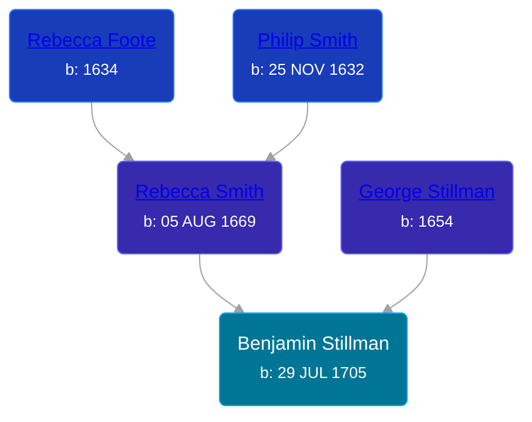

## 🔵 Benjamin Stillman
<small>Age: 74y, 4m, 1d</small>

Son of [George Stillman](/people/6/67040632) and [Rebecca Smith](/people/7/76162584)





### 📆 Events


Type | Date | Age at Event | Place
------ | ------ | ------ | ------
[Birth](#event-event-2) | 29 JUL 1705 |  |
[Death](#event-event-3) | 1780 | 74y, 4m, 1d |



- **[Birth](#event-event-2)**
**Date**: 29 JUL 1705, Age:
**Place**:
- **[Death](#event-event-3)**
**Date**: 1780, Age: 74y, 4m, 1d
**Place**:


### 📰 Event Sources

####  Birth, 29 JUL 1705
* The Foote Family: or the Descendants of Nathaniel Foote  - 280

####  Death, 1780
* The History of the Treman, Tremaine, Truman Family in America  - 1772