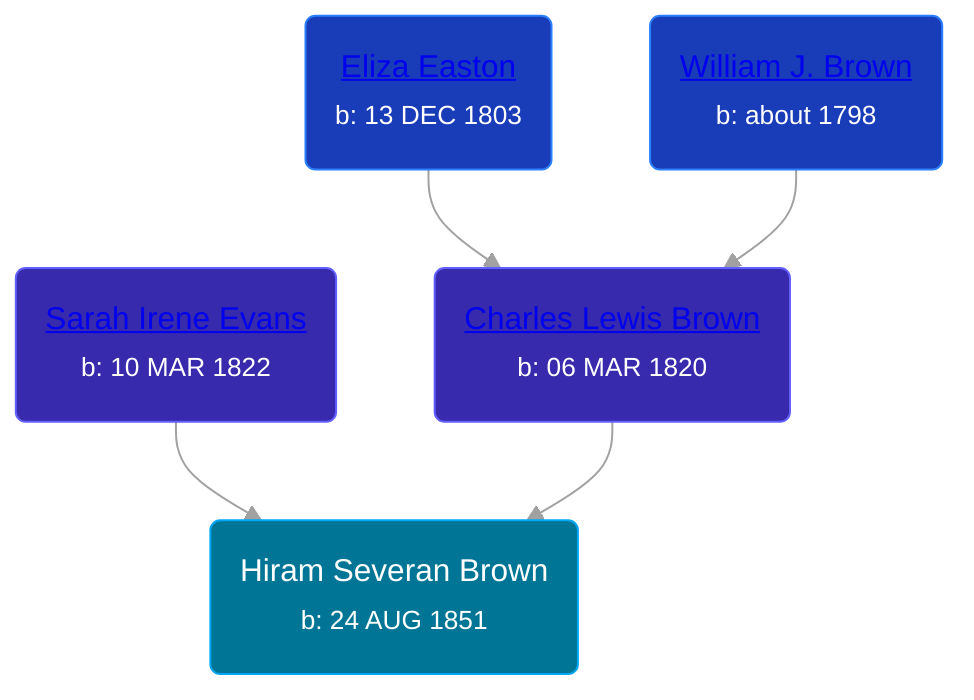

## 🔵 Hiram Severan Brown
<small>Age: 64y, 4m, 16d</small>

Son of [Charles Lewis Brown](/people/7/70538697) and [Sarah Irene Evans](/people/4/47294572)





### 📆 Events


Type | Date | Age at Event | Place
------ | ------ | ------ | ------
Birth | 24 AUG 1851 |  | New York, USA
[Death](#event-event-3) | 10 JAN 1916 | 64y, 4m, 16d | Redding, Clare, Michigan, USA



- **Birth**
**Date**: 24 AUG 1851, Age:
**Place**: New York, USA
- **[Death](#event-event-3)**
**Date**: 10 JAN 1916, Age: 64y, 4m, 16d
**Place**: Redding, Clare, Michigan, USA


### 📰 Event Sources

####  Death, 10 JAN 1916
* Michigan, Death Records, 1867-1950
>   
  > Name: Heram Sevearn Brown  
  > Gender: Male  
  > Age: 64  
  > Race: White  
  > Birth Year: 1852  
  > Death Date: 10 Jan 1916  
  > Death Place: Redding, Clare, Michigan, USA  
  > Father: Charles Lewis Brown  
  > Mother: Sarah Brown
