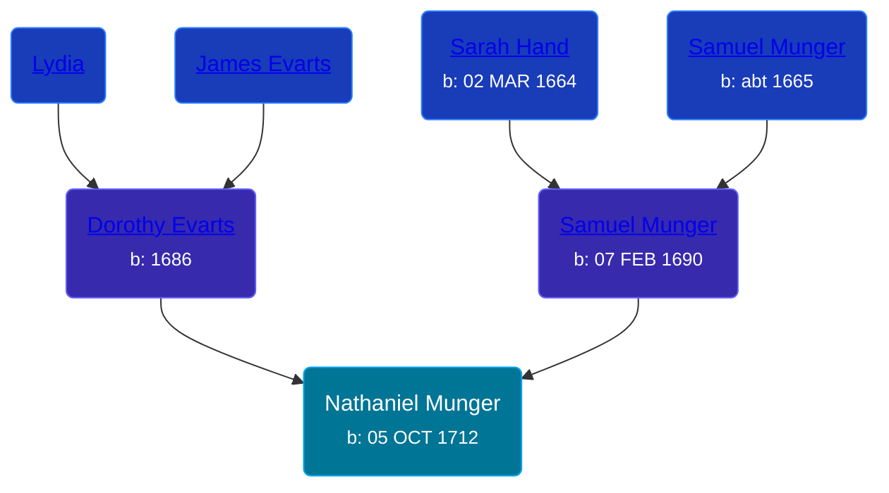

## 🔵 Nathaniel Munger
<small>Age: 87y, 11m, 11d</small>

Son of [Samuel Munger](/people/6/64239804) and [Dorothy Evarts](/people/5/59501816)





### 📆 Events


Type | Date | Age at Event | Place
------ | ------ | ------ | ------
[Birth](#event-event-2) | 05 OCT 1712 |  | Guilford, Connecticut, USA
[Death](#event-event-3) | 16 SEP 1800 | 87y, 11m, 11d | South Brimfield, Massachusetts, USA



- **[Birth](#event-event-2)**
**Date**: 05 OCT 1712, Age:
**Place**: Guilford, Connecticut, USA
- **[Death](#event-event-3)**
**Date**: 16 SEP 1800, Age: 87y, 11m, 11d
**Place**: South Brimfield, Massachusetts, USA


### 📰 Event Sources

####  Birth, 05 OCT 1712
* The Munger Book  - 204

####  Death, 16 SEP 1800
* The Munger Book  - 209