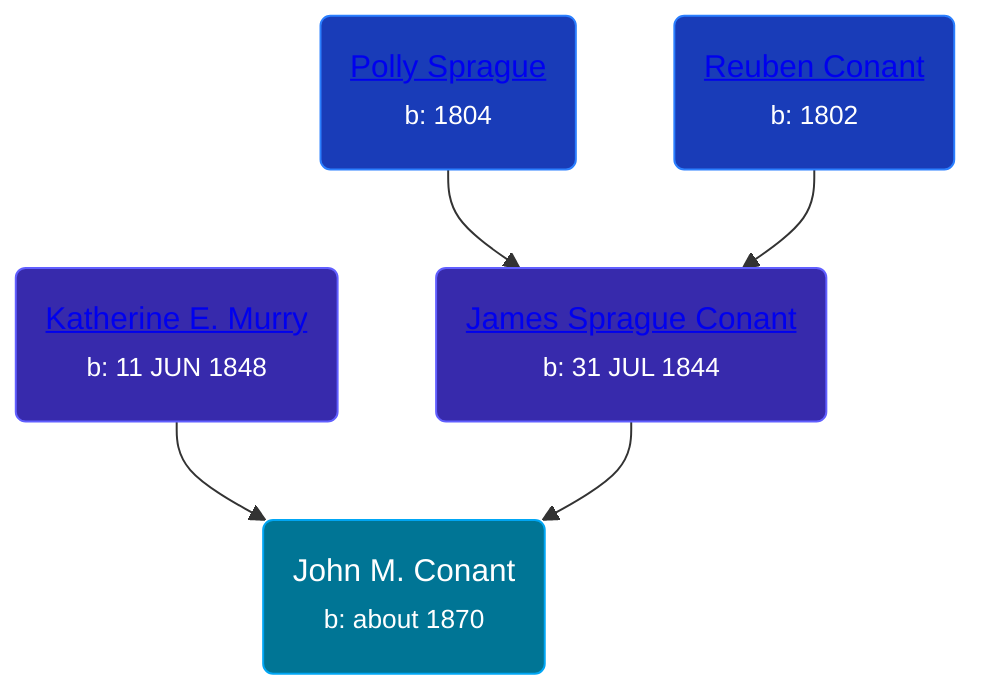

## 🔵 John M. Conant

Son of [James Sprague Conant](/people/6/62404416) and [Katherine E. Murry](/people/2/25746290)





### 📆 Events


Type | Date | Age at Event | Place
------ | ------ | ------ | ------
Birth | about 1870 |  | Michigan, USA
[Residence](#event-event-0) | 1880 | 10y | Robinson Township, Ottawa, Michigan, USA
[Residence](#event-event-1) | 1910 | 40y | Robinson Township, Ottawa, Michigan, USA
[Residence](#event-event-2) | 1920 | 50y | Grand Haven, Ottawa, Michigan, USA



- **Birth**
**Date**: about 1870, Age:
**Place**: Michigan, USA
- **[Residence](#event-event-0)**
**Date**: 1880, Age: 10y
**Place**: Robinson Township, Ottawa, Michigan, USA
- **[Residence](#event-event-1)**
**Date**: 1910, Age: 40y
**Place**: Robinson Township, Ottawa, Michigan, USA
- **[Residence](#event-event-2)**
**Date**: 1920, Age: 50y
**Place**: Grand Haven, Ottawa, Michigan, USA


## 👩‍❤️‍👨 Relationships

### 🟣 [Maude ](/people/5/58402932), b. about 1875

#### Children With Maude
* 🔵 [Ray Conant](/people/9/99936990), b. about 1892
* 🔵 [Robert J. Conant](/people/7/75124444), b. about 1896
* 🔵 [Vernon Conant](/people/1/15985527), b. 14 MAY 1902
### 📰 Event Sources

####  Residence, 1880
* 1880 US Census

####  Residence, 1910
* 1910 US Census

####  Residence, 1920
* 1920 US Census
