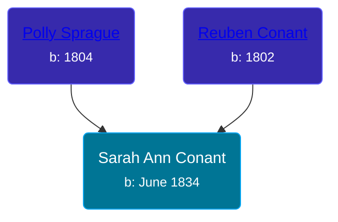

## 🟣 Sarah Ann Conant
<small>Age: 74y, 6m</small>

Daughter of [Reuben Conant](/people/7/72221832) and [Polly Sprague](/people/5/53927626)





### 📆 Events


Type | Date | Age at Event | Place
------ | ------ | ------ | ------
Birth | June 1834 |  | New York, USA
[Residence](#event-event-0) | 30 SEP 1850 | 16y, 3m, 30d | Savannah, Wayne, New York, USA
[Residence](#event-event-1) | 07 JUL 1860 | 26y, 1m, 7d | Savannah, Wayne, New York, USA
[Residence](#event-event-2) | 15 JUN 1870 | 36y, 15d | Savannah, Wayne, New York, USA
[Residence](#event-event-3) | 04 JUN 1880 | 46y, 4d | Butler, Wayne, New York, USA
[Residence](#event-event-4) | 16 FEB 1892 | 57y, 8m, 16d | Savannah, Wayne, New York, USA
[Residence](#event-event-5) | 04 JUN 1900 | 66y, 4d | Wolcott, Wayne, New York, USA
Death | 1909 | 74y, 6m | New York, USA
[Burial](#event-event-11) |  |  | Butler-Savannah Cemetery, Savannah, Wayne, New York, USA



- **Birth**
**Date**: June 1834, Age:
**Place**: New York, USA
- **[Residence](#event-event-0)**
**Date**: 30 SEP 1850, Age: 16y, 3m, 30d
**Place**: Savannah, Wayne, New York, USA
- **[Residence](#event-event-1)**
**Date**: 07 JUL 1860, Age: 26y, 1m, 7d
**Place**: Savannah, Wayne, New York, USA
- **[Residence](#event-event-2)**
**Date**: 15 JUN 1870, Age: 36y, 15d
**Place**: Savannah, Wayne, New York, USA
- **[Residence](#event-event-3)**
**Date**: 04 JUN 1880, Age: 46y, 4d
**Place**: Butler, Wayne, New York, USA
- **[Residence](#event-event-4)**
**Date**: 16 FEB 1892, Age: 57y, 8m, 16d
**Place**: Savannah, Wayne, New York, USA
- **[Residence](#event-event-5)**
**Date**: 04 JUN 1900, Age: 66y, 4d
**Place**: Wolcott, Wayne, New York, USA
- **Death**
**Date**: 1909, Age: 74y, 6m
**Place**: New York, USA
- **[Burial](#event-event-11)**
**Date**:
**Place**: Butler-Savannah Cemetery, Savannah, Wayne, New York, USA


## 👩‍❤️‍👨 Relationships

### 🔵 [Cambrus Wilson](/people/8/82575654), b. April 1833

#### Events


Type | Date | Age at Event | Place
------ | ------ | ------ | ------
Marriage | 1852 | 17y, 6m |



- **Marriage**
**Date**: 1852, Age: 17y, 6m
**Place**:


#### Children With Cambrus Wilson
* 🔵 [Hiram Wilson](/people/5/58050398), b. about 1853
* 🟣 [Phebe J. Wilson](/people/9/96493800), b. about 1855
* 🔵 [Charles Wilson](/people/6/64845280), b. about 1857
* 🟣 [Flora Wilson](/people/2/2426620), b. Nov 1863
* 🔵 [Cambyses Wilson](/people/3/335666), b. June 1864
* 🟣 [Alice Wilson](/people/4/41702), b. about 1867
### 📰 Event Sources

####  Residence, 30 SEP 1850
* 1850 US Census

####  Residence, 07 JUL 1860
* 1860 US Census

####  Residence, 15 JUN 1870
* 1870 US Census

####  Residence, 04 JUN 1880
* 1880 US Census

####  Residence, 16 FEB 1892
* 1892 New York Census

####  Residence, 04 JUN 1900
* 1900 US Census

####  Burial
* findagrave.com

####  Marriage, 1852
