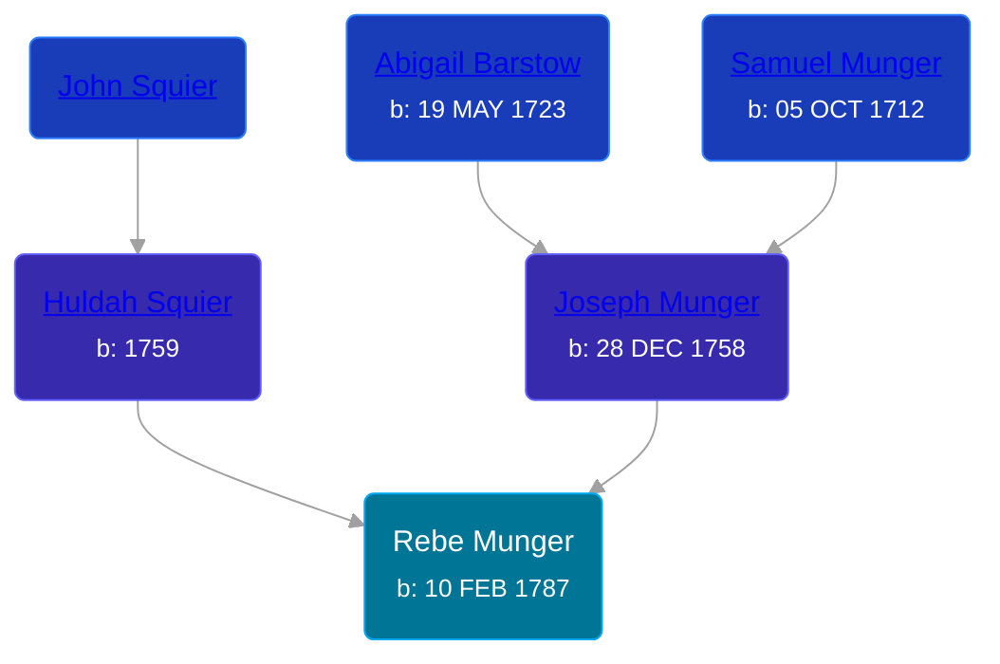

## 🟣 Rebe Munger
<small>Age: 75y, 8m, 22d</small>

Daughter of [Joseph Munger](/people/4/48832802) and [Huldah Squier](/people/4/40449307)





### 📆 Events


Type | Date | Age at Event | Place
------ | ------ | ------ | ------
[Birth](#event-event-2) | 10 FEB 1787 |  | South Brimfield, Massachusetts, USA
[Death](#event-event-3) | 02 NOV 1862 | 75y, 8m, 22d | Wales, Massachusetts, USA



- **[Birth](#event-event-2)**
**Date**: 10 FEB 1787, Age:
**Place**: South Brimfield, Massachusetts, USA
- **[Death](#event-event-3)**
**Date**: 02 NOV 1862, Age: 75y, 8m, 22d
**Place**: Wales, Massachusetts, USA


### 📰 Event Sources

####  Birth, 10 FEB 1787
* Massachusetts, Town and Vital Records, 1620-1988  - 274
* The Munger Book  - 263

####  Death, 02 NOV 1862
* The Munger Book  - 263
* Massachusetts, Town and Vital Records, 1620-1988  - 179