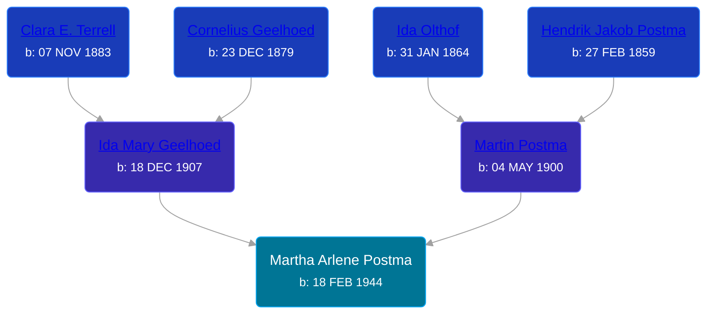

## 🟣 Martha Arlene Postma
<small>Age: 77y, 10m, 11d</small>

Daughter of [Martin Postma](/people/7/7474832) and [Ida Mary Geelhoed](/people/1/11612484)





### 📆 Events


Type | Date | Age at Event | Place
------ | ------ | ------ | ------
Birth | 18 FEB 1944 |  | Gaines Township, Kent, Michigan, USA
[Residence](#event-event-0) | 17 APR 1950 | 6y, 1m, 29d | Gaines Township, Kent, Michigan, USA
[Death](#event-event-5) | 29 DEC 2021 | 77y, 10m, 11d | Wyoming, Kent, Michigan, USA
Burial |  |  | Chapel Hill Memorial Gardens, Cascade, Kent, Michigan, USA



- **Birth**
**Date**: 18 FEB 1944, Age:
**Place**: Gaines Township, Kent, Michigan, USA
- **[Residence](#event-event-0)**
**Date**: 17 APR 1950, Age: 6y, 1m, 29d
**Place**: Gaines Township, Kent, Michigan, USA
- **[Death](#event-event-5)**
**Date**: 29 DEC 2021, Age: 77y, 10m, 11d
**Place**: Wyoming, Kent, Michigan, USA
- **Burial**
**Date**:
**Place**: Chapel Hill Memorial Gardens, Cascade, Kent, Michigan, USA


## 👩‍❤️‍👨 Relationships

### 🔵 [Duane LaVerne Wilson](/people/6/61086158), b. 19 APR 1945

#### Events


Type | Date | Age at Event | Place
------ | ------ | ------ | ------
[Marriage](#event-family-0-event-0) | 27 MAR 1964 | 20y, 1m, 9d | Grand Rapids, Kent, Michigan, United States



- **[Marriage](#event-family-0-event-0)**
**Date**: 27 MAR 1964, Age: 20y, 1m, 9d
**Place**: Grand Rapids, Kent, Michigan, United States


#### Children With Duane LaVerne Wilson
* 🟣 [Living Person](/people/9/92555368)
* 🔵 [Duane LaVerne Wilson](/people/2/26268040), b. 08 SEP 1965
* 🟣 [Living Person](/people/4/47560746)
* 🟣 [Living Person](/people/4/46067436)
* 🔵 [Keith Allen Wilson](/people/3/37910144), b. 02 JUN 1970
### 📰 Event Sources

####  Residence, 17 APR 1950
* 1950 US Census
>   
  > Name: Martha Postma  
  > Age: 6  
  > Birth Date: abt 1944  
  > Gender: Female  
  > Race: White  
  > Birth Place: Michigan  
  > Marital Status: Never Married (Single)  
  > Relation to Head of House: Daughter  
  > Residence Date: 1950  
  > Home in 1950: Gaines, Kent, Michigan, USA  
  > Street Name: 60th Street  
  > Apartment Number: 2864  
  > Dwelling Number: 271  
  > Farm: Yes  
  > Occupation: Employee  
  >   
  > Household members:  
  > Martin Postma, 49, Head  
  > Ida Postma, 42, Wife  
  > Leona Postma, 21, Daughter  
  > Martin Postma Jr, 18, Son  
  > Kenneth Postma, 14, Son  
  > David Postma, 10, Son  
  > Joseph Postma, 7, Son  
  > Martha Postma, 6, Daughter  
  > Henry Postma, 90, Father  
  >

####  Marriage, 27 MAR 1964
* Kent County Marriage Records

####  Death, 29 DEC 2021
* MLive
>   
  > MARTHA WILSON OBITUARY  
  >   
  > Martha Arlene Wilson, age 77, went to be with her Lord Wednesday, December 29, 2021. Martha was preceded in death by her parents Martin and Ida Postma; husband, Duane; son, Duane Jr.; and great-grandson Ethan Desero. She will be remembered by her children; grandchildren; great-grandchildren; many nieces, nephews, and friends.  
  >   
  > A Celebration of Martha's Life will take place 12 p.m. Friday, January 7, 2022 at Cook Memorial Chapel (East building), 4235 Prairie St. SW, Grandville, MI 49418. Pastor Dennis Gilbert will be officiating. Visitation with relatives and friends will commence prior to the service from 11 a.m. - 12 p.m. When in attendance, we kindly ask that all non-vaccinated guests wear a face covering and practice social distancing for their safety and well-being of the family. Interment will be at Chapel Hill Memorial Gardens. The family welcomes memories and messages in their guest book online at www.cookcaresgrandville.com
