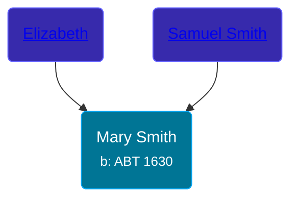

## 🟣 Mary Smith
<small>Age: 38y, 12m, 16d</small>

Daughter of [Samuel Smith](/people/8/86804391) and [Elizabeth ](/people/7/71389724)





### 📆 Events


Type | Date | Age at Event | Place
------ | ------ | ------ | ------
Birth | ABT 1630 |  |
[Death](#event-event-3) | 16 DEC 1668 | 38y, 12m, 16d |



- **Birth**
**Date**: ABT 1630, Age:
**Place**:
- **[Death](#event-event-3)**
**Date**: 16 DEC 1668, Age: 38y, 12m, 16d
**Place**:


### 📰 Event Sources

####  Death, 16 DEC 1668
* History of the Town of Sunderland, Massachusetts  - 532
