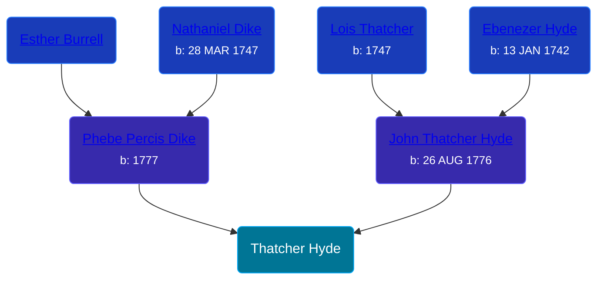

## 🔵 Thatcher Hyde
<small>Age: undefined</small>

Son of [John Thatcher Hyde](/people/3/3310224) and [Phebe Percis Dike](/people/4/41577072)





### 📆 Events


Type | Date | Age at Event | Place
------ | ------ | ------ | ------
[Birth](#event-event-2) |  |  |
[Death](#event-event-3) | 20 NOV 1863 | undefined |



- **[Birth](#event-event-2)**
**Date**:
**Place**:
- **[Death](#event-event-3)**
**Date**: 20 NOV 1863, Age: undefined
**Place**:


## 👩‍❤️‍👨 Relationships

### 🟣 [Polly Gorton](/people/7/75099648), b. 09 JUL 1823

#### Events


Type | Date | Age at Event | Place
------ | ------ | ------ | ------
[Marriage](#event-family-0-event-0) | 10 SEP 1843 | undefined |



- **[Marriage](#event-family-0-event-0)**
**Date**: 10 SEP 1843, Age: undefined
**Place**:


### 📰 Event Sources

####  Birth
* History of Allegany County, N.Y

####  Marriage, 10 SEP 1843
* The Life and Times of Samuel Gorton
* The Wellsville Story
####  Death, 20 NOV 1863
* History of Allegany County, N.Y
* The Life and Times of Samuel Gorton
