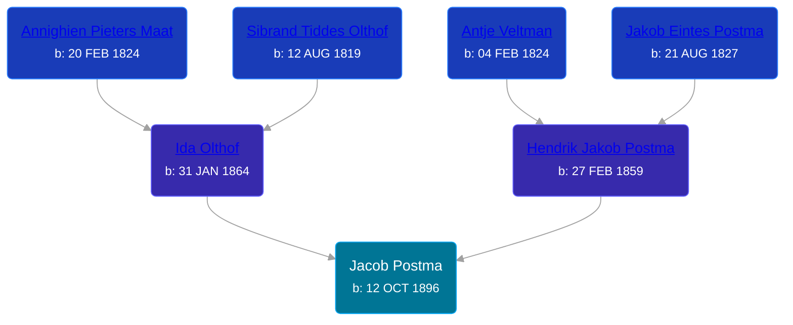

## 🔵 Jacob Postma
<small>Age: 73y, 8m, 1d</small>

Son of [Hendrik Jakob Postma](/people/3/31727152) and [Ida Olthof](/people/6/60020862)





### 📆 Events


Type | Date | Age at Event | Place
------ | ------ | ------ | ------
[Birth](#event-event-2) | 12 OCT 1896 |  | Gaines Township, Kent, Michigan, USA
[Residence](#event-event-0) | 29 JUN 1900 | 3y, 8m, 17d | Gaines Township, Kent, Michigan, USA
[Residence](#event-event-1) | 1910 | 13y, 1m, 18d | Gaines Township, Kent, Michigan, USA
[Residence](#event-event-2) | 1920 | 23y, 1m, 18d | Gaines Township, Kent, Michigan, USA
[Death](#event-event-6) | 13 JUN 1970 | 73y, 8m, 1d | Grand Rapids, Kent, Michigan, United States
[Burial](#event-event-7) | 16 JUN 1970 | 73y, 8m, 4d | Pine Hill Cemetery, Kentwood, Kent, Michigan, USA



- **[Birth](#event-event-2)**
**Date**: 12 OCT 1896, Age:
**Place**: Gaines Township, Kent, Michigan, USA
- **[Residence](#event-event-0)**
**Date**: 29 JUN 1900, Age: 3y, 8m, 17d
**Place**: Gaines Township, Kent, Michigan, USA
- **[Residence](#event-event-1)**
**Date**: 1910, Age: 13y, 1m, 18d
**Place**: Gaines Township, Kent, Michigan, USA
- **[Residence](#event-event-2)**
**Date**: 1920, Age: 23y, 1m, 18d
**Place**: Gaines Township, Kent, Michigan, USA
- **[Death](#event-event-6)**
**Date**: 13 JUN 1970, Age: 73y, 8m, 1d
**Place**: Grand Rapids, Kent, Michigan, United States
- **[Burial](#event-event-7)**
**Date**: 16 JUN 1970, Age: 73y, 8m, 4d
**Place**: Pine Hill Cemetery, Kentwood, Kent, Michigan, USA


### 📰 Event Sources

####  Birth, 12 OCT 1896
* Michigan, U.S., Birth Records, 1867-1914
>   
  > Name: Jacob Pastma  
  > Gender: Male  
  > Race: White  
  > Birth Date: 12 Oct 1896  
  > Birth Place: Ganies, Michigan, USA  
  > Father: Henry Pastma  
  > Mother: Ida Pastma  
  > Jurisdiction Number: 9487  
  > Reference Number: 81  
  >

####  Residence, 29 JUN 1900
* 1900 US Census
>   
  > Name: Jacob Postma  
  > Sex: Male  
  > Age: 3  
  > Birth Date: September 1897  
  > Birthplace: Michigan  
  > Marital Status: Single  
  > Race: White  
  > Relationship to Head of Household: Son  
  > Father's Birthplace: Holland  
  > Mother's Birthplace: Holland  
  > Event Type: Census  
  > Event Date: 1900  
  > Event Place: Gaines Township, Kent, Michigan, United States  
  > Line Number: 15  
  > Sheet Letter: A  
  > Sheet Number: 13

####  Residence, 1910
* 1910 US Census

####  Residence, 1920
* 1920 US Census

####  Death, 13 JUN 1970
* U.S., Social Security Death Index, 1935-2014
>   
  > Name: JAKE POSTMA  
  > Birth: 12 Oct 1896  
  > Death: Jun 1970  
  > Last Residence: 49508 (Grand Rapids, Kent, MI)  
  > Last Benefit: (none specified)  
  > SSN: ###-##-####  
  > Issued: Michigan
* The Grand Rapids Press  - 13 Jun 1970
>   
  > POSTMA -- Jake Postma, aged 74, of 3006 60th St. SE, passed away June13, 1970 at Butterworth Hospital. Surviving are three brothers, Sam and Charles, both of Grand Rapids, and Peter of Wyoming; one sister, Mrs. Richard (Jennie) Weaver of Kentwood. Mr. Postma reposes at the Vanderpool Chapel, 3131 S. Division, where funeral services will be held Monday at 3 pm. Interment Pine Hill Cemetery.

####  Burial, 16 JUN 1970
* Pine Hill Cemetery, Personal Visit
>   
  > Postma, Jake  
  > b: Oct 12 1895; d: June 13 1970