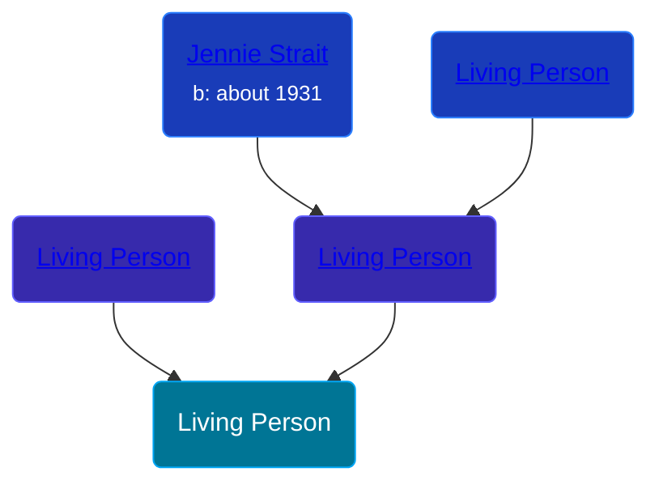

## 🔵 Living Person

Son of [Living Person](/people/7/77213200) and [Living Person](/people/2/20979328)



```mermaid
graph
classDef grands fill:#193cb8,stroke:#2b7fff,stroke-width:1px,color:#fff;
classDef parents fill:#372aac,stroke:#615fff,stroke-width:1px,color:#fff;
classDef primary fill:#007595,stroke:#00a6f4,stroke-width:1px,color:#fff;
40255380(Living Person):::primary
20979328(<a class="text-white" href="/people/2/20979328">Living Person</a>):::parents-->40255380
77213200(<a class="text-white" href="/people/7/77213200">Living Person</a>):::parents-->40255380
6678780(<a class="text-white" href="/people/6/6678780">Jennie Strait</a><br /><small>b: about 1931</small>):::grands-->77213200
25349238(<a class="text-white" href="/people/2/25349238">Living Person</a>):::grands-->77213200
```

