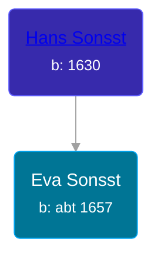

## 🟣 Eva Sonsst

Daughter of [Hans Sonsst](/people/3/36708566)





### 📆 Events


Type | Date | Age at Event | Place
------ | ------ | ------ | ------
Birth | abt 1657 |  | Hoffenheim Sinsheim, Baden, Germany
Death |  |  | Hoffenheim Sinsheim, Baden, Germany



- **Birth**
**Date**: abt 1657, Age:
**Place**: Hoffenheim Sinsheim, Baden, Germany
- **Death**
**Date**:
**Place**: Hoffenheim Sinsheim, Baden, Germany


## 👩‍❤️‍👨 Relationships

### 🔵 [Johann George Kobel](/people/9/96923637), b. 03 OCT 1656

#### Children With Johann George Kobel
* 🔵 [Johann Jacob Kobel](/people/8/81342340), b. 1682