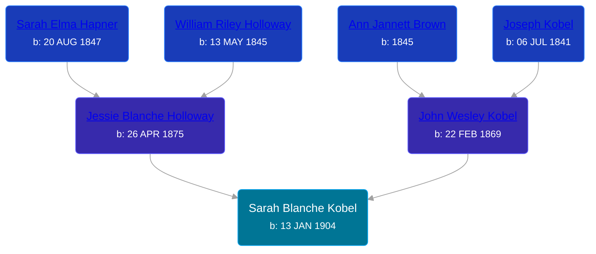

## 🟣 Sarah Blanche Kobel
<small>Age: 67y, 11m, 29d</small>

Daughter of [John Wesley Kobel](/people/2/24649136) and [Jessie Blanche Holloway](/people/2/29242864)





### 📆 Events


Type | Date | Age at Event | Place
------ | ------ | ------ | ------
Birth | 13 JAN 1904 |  | Elmira Township, Antrim, Michigan, USA
[Residence](#event-event-0) | 15 APR 1910 | 6y, 3m, 2d | Warner Township, Antrim, Michigan, USA
[Residence](#event-event-1) | 05 JAN 1920 | 15y, 11m, 22d | Warner Township, Antrim, Michigan, USA
[Residence](#event-event-2) | 05 MAY 1930 | 26y, 3m, 22d | Wyoming Township, Kent, Michigan, USA
[Death](#event-event-6) | 12 JAN 1972 | 67y, 11m, 29d | East Grand Rapids, Kent, Michigan, USA
Burial |  |  | Rest Lawn Memorial Park



- **Birth**
**Date**: 13 JAN 1904, Age:
**Place**: Elmira Township, Antrim, Michigan, USA
- **[Residence](#event-event-0)**
**Date**: 15 APR 1910, Age: 6y, 3m, 2d
**Place**: Warner Township, Antrim, Michigan, USA
- **[Residence](#event-event-1)**
**Date**: 05 JAN 1920, Age: 15y, 11m, 22d
**Place**: Warner Township, Antrim, Michigan, USA
- **[Residence](#event-event-2)**
**Date**: 05 MAY 1930, Age: 26y, 3m, 22d
**Place**: Wyoming Township, Kent, Michigan, USA
- **[Death](#event-event-6)**
**Date**: 12 JAN 1972, Age: 67y, 11m, 29d
**Place**: East Grand Rapids, Kent, Michigan, USA
- **Burial**
**Date**:
**Place**: Rest Lawn Memorial Park


## 👩‍❤️‍👨 Relationships

### 🔵 [William Henry Workman](/people/6/64556940), b. 14 MAR 1909

#### Children With William Henry Workman
* 🟣 [Living Person](/people/6/68599690)
* 🔵 [Living Person](/people/5/52114384)
### 📰 Event Sources

####  Residence, 15 APR 1910
* 1910 US Census

####  Residence, 05 JAN 1920
* 1920 US Census

####  Residence, 05 MAY 1930
* 1930 US Census

####  Death, 12 JAN 1972
* Michigan Deaths, 1971-1996
>   
  > Name:  Sarah Workman  
  > Birth Date: 13 Jan 1904  
  > Death Date: 12 Jan 1972  
  > Gender: Female  
  > Residence: Wyoming, Kent, Michigan  
  > Place of Death: East Grnd Rapids, Kent, Michigan
* The Grand Rapids Press
>   
  > WORKMAN -- Mrs. Sarah Workman, aged 67 of 225 Celia St. SE, passed away Wednesday evening at Blodgett Hospital. Surviving are her husband, John F.; one son, Fred of Houston, Tex.; one daughter, Mrs. Robe (Bertha) Doezema of Dutton; two grandchildren; one brother, Harry Kobel of Gladwin; three sisters, Mrs. Bessie Metzger of Grand Rapids, Mrs. Elvira Kolk, Mrs. Clare (Jessie) Gould, both of Chippewa Lake. Services will be hed Saturday at 1:30 at the Zaagman Memorial Chapel, Rev. Elton VanPernis officiating. Interment Rest Lawn Memorial Park.
* U.S., Social Security Death Index, 1935-2014
>   
  > Name: SARAH WORKMAN  
  > Birth: 13 Jan 1904  
  > Death: Jan 1972  
  > Last Residence: 49508 (Grand Rapids, Kent, MI)  
  > Last Benefit: (none specified)  
  > SSN: ###-##-###  
  > Issued: Michigan
