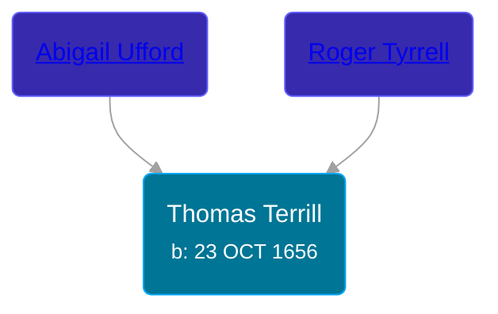

## 🔵 Thomas Terrill
<small>Age: 95y, 1m, 7d</small>

Son of [Roger Tyrrell](/people/2/2108514) and [Abigail Ufford](/people/9/99473444)





### 📆 Events


Type | Date | Age at Event | Place
------ | ------ | ------ | ------
[Birth](#event-event-2) | 23 OCT 1656 |  |
Death | 1752 | 95y, 1m, 7d | Elizabeth, New Jersey, USA



- **[Birth](#event-event-2)**
**Date**: 23 OCT 1656, Age:
**Place**:
- **Death**
**Date**: 1752, Age: 95y, 1m, 7d
**Place**: Elizabeth, New Jersey, USA


### 📰 Event Sources

####  Birth, 23 OCT 1656
* Roger and Abigail (Ufford) Terrill and Some Descendants: 1632 - 1993  - 6
