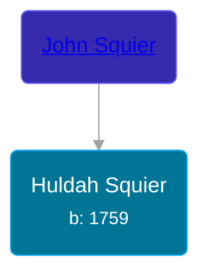

## 🟣 Huldah Squier
<small>Age: 76y, 11m, 18d</small>

Daughter of [John Squier](/people/3/35783343)





### 📆 Events


Type | Date | Age at Event | Place
------ | ------ | ------ | ------
[Birth](#event-event-3) | 1759 |  |
[Death](#event-event-4) | 18 NOV 1835 | 76y, 11m, 18d | Wales, Massachusetts, USA



- **[Birth](#event-event-3)**
**Date**: 1759, Age:
**Place**:
- **[Death](#event-event-4)**
**Date**: 18 NOV 1835, Age: 76y, 11m, 18d
**Place**: Wales, Massachusetts, USA


## 👩‍❤️‍👨 Relationships

### 🔵 [Joseph Munger](/people/4/48832802), b. 28 DEC 1758

#### Events


Type | Date | Age at Event | Place
------ | ------ | ------ | ------
[Marriage](#event-family-0-event-0) | Jun 1781 | 22y, 6m |



- **[Marriage](#event-family-0-event-0)**
**Date**: Jun 1781, Age: 22y, 6m
**Place**:


#### Children With Joseph Munger
* 🟣 [Living Person](/people/9/92752548)
* 🟣 [Living Person](/people/5/57250648)
* 🔵 [Stillman Munger](/people/5/55728126), b. 26 JAN 1783
* 🟣 [Wealthy Munger](/people/3/31830663), b. 13 FEB 1785
* 🟣 [Rebe Munger](/people/3/39304822), b. 10 FEB 1787
* 🟣 [Miriam Munger](/people/1/13266841), b. 21 FEB 1789
* 🔵 [Roswell Munger](/people/2/21686617), b. Mar 1791
* 🟣 [Orilla Munger](/people/6/60133360), b. 25 JUN 1800
### 📰 Event Sources

####  Birth, 1759
* The Munger Book  - 230

####  Marriage, Jun 1781
* Massachusetts, Town and Vital Records, 1620-1988  - 274
* The Munger Book  - 230
####  Death, 18 NOV 1835
* The Munger Book  - 230
* Massachusetts, Town and Vital Records, 1620-1988  - 274
