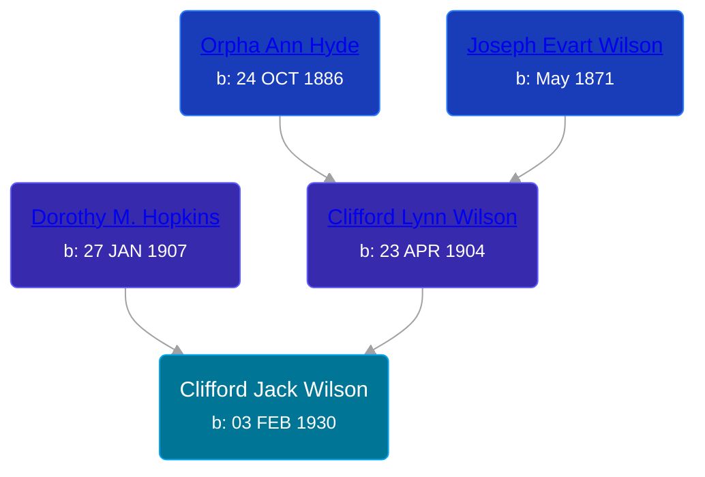

## 🔵 Clifford Jack Wilson
<small>Age: 87y, 7m, 2d</small>

Son of [Clifford Lynn Wilson](/people/4/42196820) and [Dorothy M. Hopkins](/people/8/86759136)





### 📆 Events


Type | Date | Age at Event | Place
------ | ------ | ------ | ------
Birth | 03 FEB 1930 |  | Grand Rapids, Kent, Michigan, United States
[Residence](#event-event-0) | 1930 | -1y, 9m, 27d | Grand Rapids, Kent, Michigan, United States
[Residence](#event-event-1) | 1940 | 9y, 9m, 27d | Grand Rapids, Kent, Michigan, United States
[Death](#event-event-5) | 05 SEP 2017 | 87y, 7m, 2d |



- **Birth**
**Date**: 03 FEB 1930, Age:
**Place**: Grand Rapids, Kent, Michigan, United States
- **[Residence](#event-event-0)**
**Date**: 1930, Age: -1y, 9m, 27d
**Place**: Grand Rapids, Kent, Michigan, United States
- **[Residence](#event-event-1)**
**Date**: 1940, Age: 9y, 9m, 27d
**Place**: Grand Rapids, Kent, Michigan, United States
- **[Death](#event-event-5)**
**Date**: 05 SEP 2017, Age: 87y, 7m, 2d
**Place**:


## 👩‍❤️‍👨 Relationships

### 🟣 [Ardis ](/people/1/16505489), b. 26 AUG 1929

### ⚪ Unknown Person

#### Children With Unknown Person
* 🟣 [Living Person](/people/8/83748092)
### 🟣 [Living Person](/people/2/25999373)

### 📰 Event Sources

####  Residence, 1930
* 1930 US Census

####  Residence, 1940
* 1940 US Census

####  Death, 05 SEP 2017
* The Grand Rapids Press
>   
  > Wilson, Clifford Clifford Jack "CJ" Wilson of Rockford, Michigan, age 87, passed away on Tuesday, September 5, 2017. He was born to Clifford and Dorothy (Heeringa) Wilson on February 3, 1930, in Grand Rapids, MI. CJ enjoyed wading in the river and fishing, archery hunting, playing golf, and spending time with family, especially his grandchildren. He was a veteran of the United States Army. CJ is survived by his loving daughter Sherry Lynn (Bill) Newman; grandchildren Lynn (Jeff) Hiddema and Jason (Andrea) Newman, adored great grandchildren Hannah, Christopher, and Raelynn, and several nieces and nephews. He was preceded in death by his beloved wife of 38 years Ardis Wilson. There will be a time of visitation from 4:00 p.m. until 7:00 p.m. on Friday, September 8, 2017, at Pederson Funeral Home, 127 N. Monroe Street NE, Rockford, MI 49341. The funeral service for CJ will be celebrated at 11:00 a.m. on Saturday, September 9, 2017, at Pederson Funeral Home. Pastor Bruce Wilson will be officiating. There will also be a one hour visitation prior to the service.
