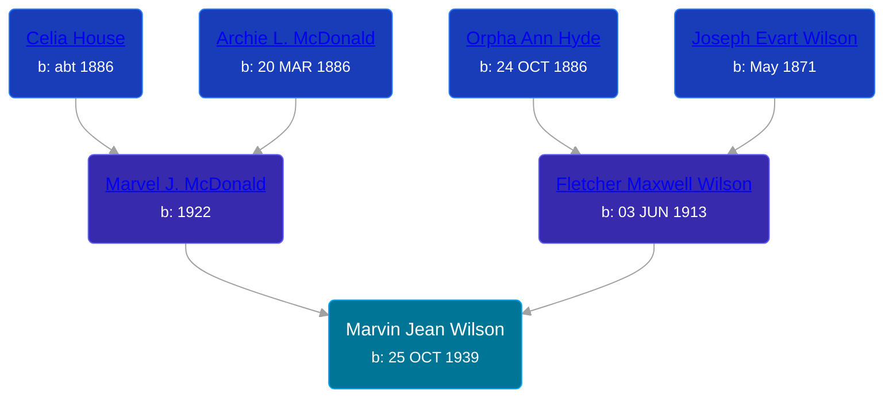

## 🔵 Marvin Jean Wilson
<small>Age: 65y, 17d</small>

Son of [Fletcher Maxwell Wilson](/people/3/32597724) and [Marvel J. McDonald](/people/1/1324224)





### 📆 Events


Type | Date | Age at Event | Place
------ | ------ | ------ | ------
Birth | 25 OCT 1939 |  | Grand Rapids, Kent, Michigan, United States
[Residence](#event-event-0) | 17 APR 1940 | 5m, 22d | Grand Rapids, Kent, Michigan, United States
[Residence](#event-event-1) | 07 APR 1950 | 10y, 5m, 12d | Wyoming, Kent, Michigan, USA
[Death](#event-event-5) | 12 NOV 2004 | 65y, 17d | High Springs, Florida, USA



- **Birth**
**Date**: 25 OCT 1939, Age:
**Place**: Grand Rapids, Kent, Michigan, United States
- **[Residence](#event-event-0)**
**Date**: 17 APR 1940, Age: 5m, 22d
**Place**: Grand Rapids, Kent, Michigan, United States
- **[Residence](#event-event-1)**
**Date**: 07 APR 1950, Age: 10y, 5m, 12d
**Place**: Wyoming, Kent, Michigan, USA
- **[Death](#event-event-5)**
**Date**: 12 NOV 2004, Age: 65y, 17d
**Place**: High Springs, Florida, USA


## 👩‍❤️‍👨 Relationships

### 🟣 [Sandy ](/people/3/30798033)

#### Children With Sandy
* 🟣 [Living Person](/people/4/48485755)
* 🔵 [Living Person](/people/3/34064299)
* 🔵 [Living Person](/people/6/61079996)
* 🟣 [Living Person](/people/9/9874246)
* 🔵 [Living Person](/people/3/32081354)
* 🟣 [Charlotte Marie Wilson](/people/1/13972960), b. about 1863
### 📰 Event Sources

####  Residence, 17 APR 1940
* 1940 US Census
>   
  > Name: Marvin G Wilson  
  > Age: 5/12  
  > Estimated Birth Year: abt 1940  
  > Gender: Male  
  > Race: White  
  > Birthplace: Michigan  
  > Marital Status: Single  
  > Relation to Head of House: Son  
  > Home in 1940: Grand Rapids, Kent, Michigan  
  > Street: Tzplan Ave NE  
  > House Number: 1210  
  > Sheet Number: 14A  
  > Attended School or College: No  
  > Highest Grade Completed: None  
  >   
  > Household members:  
  > Fletcher M Wilson, 27, Head  
  > Marvel J Wilson, 19, Wife  
  > William D Wilson, 2, Son  
  > Marvin G Wilson, 5/12, Son  
  >

####  Residence, 07 APR 1950
* 1950 US Census
>   
  > Name: Marvin J Wilson  
  > Age: 10  
  > Birth Date: abt 1940  
  > Gender: Male  
  > Race: Negro (Black)  
  > Birth Place: Michigan  
  > Marital Status: Never Married (Single)  
  > Relation to Head of House: Son  
  > Residence Date: 1950  
  > Home in 1950: Wyoming, Kent, Michigan, USA  
  > Street Name: Longstreet Ave  
  > House Number: 2705  
  > Dwelling Number: 96  
  > Farm: No  
  >   
  > Household members:  
  > Fletcher M Wilson, 36, Head  
  > Beatrice M Wilson, 27, Wife  
  > William D Wilson, 12, Son  
  > Marvin J Wilson, 10, Son  
  > Judith A Wilson, 9, Daughter  
  > Duane L Peterson, 4, Stepson  
  >

####  Death, 12 NOV 2004
* The Grand Rapids Press  - 17 Mar 2004
>   
  > WILSON -- Marvin Jean "Bud" Wilson, Sr., aged 64, of High Springs, Florida, passed away unexpectedly in his home on Tuesday, March 9, 2004. Bud was born Octobet 25, 1939 in Grand Rapids, Michigan. He served our country in the Navy from 1957-1960. He lived in Florida for more than 30 years and has many friends and family in both states. He worked as a boat builder until he retired in 2002 and was a member of the Lions Club. He enjoyed golf, fishing, and spending time with friends and family. He was preceded in death by his father, Fletcher M. Wilson; and his son, David Wilson. He is survived by his mother, Beatrice M. Wilson; brother, William (Judy) Wilson; sister, Judith Jeske; brother, Duane (Martha) Wilson; sister, Beatrice (Dennis) Hartley; his children, James (Charlotte) Baune, Marvin Jean Wilson Jr., Fletcher M. Wilson II, Barbara (Thomas) Jekel, Kathy Pokora; stepchildren, Wayne Touchton, Marsha Love, Sonja Williams, Steve Williams and Joey Williams; 18 grandchildren, as well as many nieces, nephews, and friends. He will be missed by all whose life he touched. A memorial service will be held 7 PM Thursday, March 18, 2004 at Evans-Carter Funeral home in High Springs, Florida.
* U.S., Social Security Applications and Claims Index, 1936-2007
>   
  > Name: Marvin Jean Wilson  
  > Gender: Male  
  > Race: White  
  > Birth Date: 25 Oct 1939  
  > Birth Place: Grand Rapids, Michigan  
  > Death Date: 12 Mar 2004  
  > Father: Flecthes M Wilson  
  > Mother: Beatrice M Metzger  
  > Type of Claim: Original SSN.  
  > Notes: Nov 1954: Name listed as MARVIN JEAN WILSON; 18 Mar 2004: Name listed as MARVIN J WILSON
