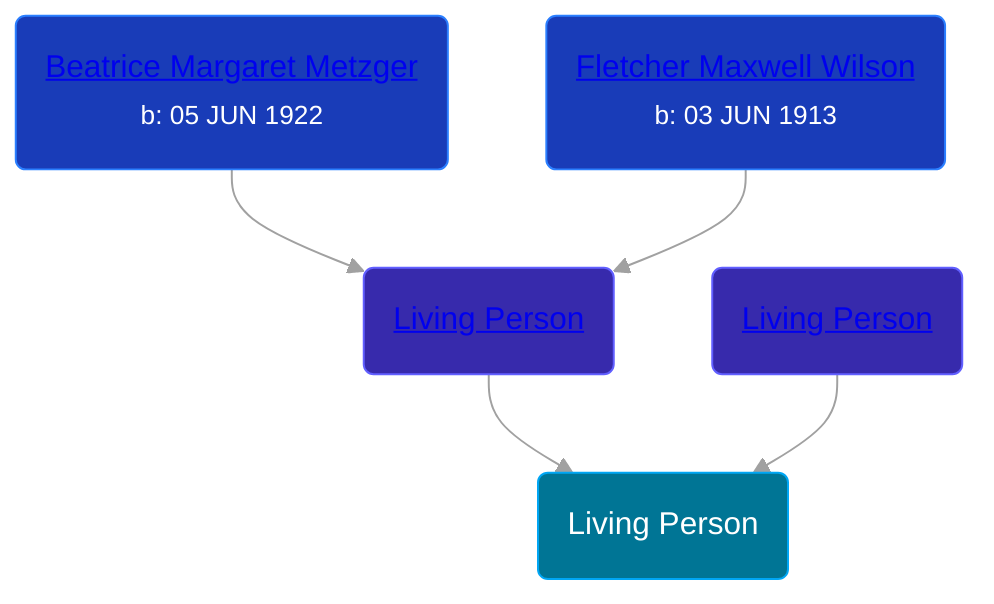

## 🔵 Living Person

Son of [Living Person](/people/2/26194004) and [Living Person](/people/9/91180844)



```mermaid
graph
classDef grands fill:#193cb8,stroke:#2b7fff,stroke-width:1px,color:#fff;
classDef parents fill:#372aac,stroke:#615fff,stroke-width:1px,color:#fff;
classDef primary fill:#007595,stroke:#00a6f4,stroke-width:1px,color:#fff;
40809017(Living Person):::primary
91180844(<a class="text-white" href="/people/9/91180844">Living Person</a>):::parents-->40809017
79763948(<a class="text-white" href="/people/7/79763948">Beatrice Margaret Metzger</a><br /><small>b: 05 JUN 1922</small>):::grands-->91180844
32597724(<a class="text-white" href="/people/3/32597724">Fletcher Maxwell Wilson</a><br /><small>b: 03 JUN 1913</small>):::grands-->91180844
26194004(<a class="text-white" href="/people/2/26194004">Living Person</a>):::parents-->40809017
linkStyle default stroke:#a1a1a1
```

