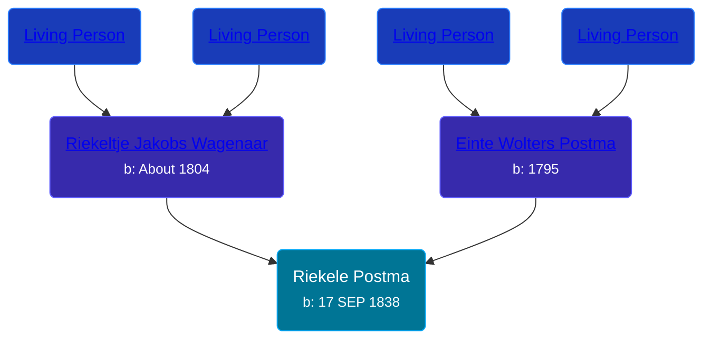

## 🔵 Riekele Postma

Son of [Einte Wolters Postma](/people/1/18880768) and [Riekeltje Jakobs Wagenaar](/people/7/77820694)





### 📆 Events


Type | Date | Age at Event | Place
------ | ------ | ------ | ------
[Birth](#event-event-2) | 17 SEP 1838 |  | Netherlands



- **[Birth](#event-event-2)**
**Date**: 17 SEP 1838, Age:
**Place**: Netherlands


## 👩‍❤️‍👨 Relationships

### 🟣 [Lyske Jans Ophuis](/people/8/80682261), b. about 1831

#### Events


Type | Date | Age at Event | Place
------ | ------ | ------ | ------
[Marriage](#event-family-0-event-0) | 10 FEB 1872 | 33y, 4m, 23d | Achtkarspelen, Netherlands



- **[Marriage](#event-family-0-event-0)**
**Date**: 10 FEB 1872, Age: 33y, 4m, 23d
**Place**: Achtkarspelen, Netherlands


### 📰 Event Sources

####  Birth, 17 SEP 1838
* Dutch Civil Register
####  Marriage, 10 FEB 1872
* Dutch Civil Register
>   
  > Source Civil register - Marriage  
  > Archive location: Tresoar, Frysk Histoarysk en Letterkundich Sintrum  
  > General Number of finding aid: 30-01  
  > Item number: 2019  
  > Municipality: Achtkarspelen  
  > Type of record: Huwelijksakte  
  > Record number: 4  
  > Registration date: 10-02-1862  
  > Bridegroom: Riekele Postma  
  > Age: 23  
  > Place of birth: Surhuisterveen  
  > Bride: Lyske Jans Ophuis  
  > Age: 31  
  > Place of birth: Surhuizum  
  > Father bridegroomEinte Wolters Postma  
  > Mother bridegroomRiekeltje Jakobs Wagenaar  
  > Father bride: Jan Sints Ophuis  
  > Mother bride: Antje Edzes Spoelstra
