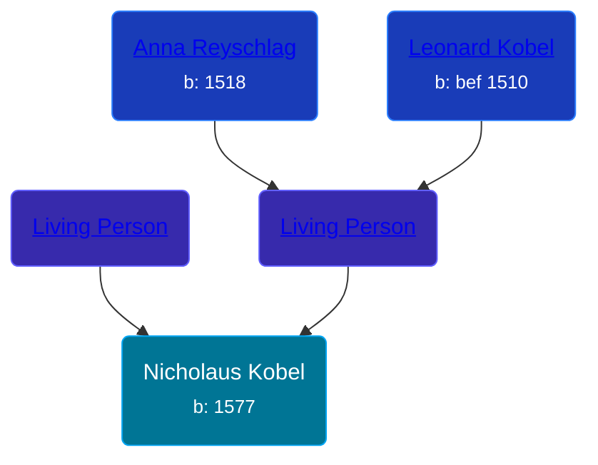

## 🔵 Nicholaus Kobel
<small>Age: 38y</small>

Son of [Living Person](/people/4/46655036) and [Living Person](/people/7/702138)





### 📆 Events


Type | Date | Age at Event | Place
------ | ------ | ------ | ------
Birth | 1577 |  | Nordlengen, Donauworth, Germany
Death | aft 1615 | 38y | Nordlengen, Donauworth, Germany



- **Birth**
**Date**: 1577, Age:
**Place**: Nordlengen, Donauworth, Germany
- **Death**
**Date**: aft 1615, Age: 38y
**Place**: Nordlengen, Donauworth, Germany


## 👩‍❤️‍👨 Relationships

### 🟣 [Bridgette Braun](/people/8/81499716), b. abt 1580

#### Children With Bridgette Braun
* 🔵 [Johann George Kobel](/people/1/13002801), b. 11 NOV 1602