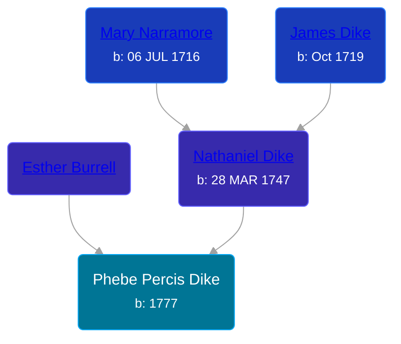

## 🟣 Phebe Percis Dike
<small>Age: 78y, 2m, 12d</small>

Daughter of [Nathaniel Dike](/people/3/36914917) and [Esther Burrell](/people/6/66432130)





### 📆 Events


Type | Date | Age at Event | Place
------ | ------ | ------ | ------
[Birth](#event-event-3) | 1777 |  | Connecticut, USA
[Residence](#event-event-0) | 17 SEP 1850 | 73y, 9m, 17d | Amity, Allegany, New York, USA
[Death](#event-event-5) | 12 FEB 1855 | 78y, 2m, 12d |
[Burial](#event-event-6) |  |  | Abbot Cemetery, Amity, Allegany, New York, USA



- **[Birth](#event-event-3)**
**Date**: 1777, Age:
**Place**: Connecticut, USA
- **[Residence](#event-event-0)**
**Date**: 17 SEP 1850, Age: 73y, 9m, 17d
**Place**: Amity, Allegany, New York, USA
- **[Death](#event-event-5)**
**Date**: 12 FEB 1855, Age: 78y, 2m, 12d
**Place**:
- **[Burial](#event-event-6)**
**Date**:
**Place**: Abbot Cemetery, Amity, Allegany, New York, USA


## 👩‍❤️‍👨 Relationships

### 🔵 [John Thatcher Hyde](/people/3/3310224), b. 26 AUG 1776

#### Events


Type | Date | Age at Event | Place
------ | ------ | ------ | ------
[Marriage](#event-family-0-event-0) | 1798 | 21y |



- **[Marriage](#event-family-0-event-0)**
**Date**: 1798, Age: 21y
**Place**:


#### Children With John Thatcher Hyde
* 🟣 [Living Person](/people/4/44848664)
* 🟣 [Living Person](/people/4/47693044)
* 🔵 [Thatcher Hyde](/people/3/39742544), b.
* 🔵 [Hannah Hyde](/people/2/2490748), b. 04 NOV 1804
* 🟣 [Lois Hyde](/people/8/83724316), b. about 1808
* 🔵 [Dewitt Clinton Hyde](/people/4/47530864), b. about 1909
### 📰 Event Sources

####  Birth, 1777
* The Hyde Ancestors of Lawrence Hyde, 1888-1960

####  Residence, 17 SEP 1850
* 1850 US Census

####  Death, 12 FEB 1855
* Abbot Cemetery
* The Hyde Ancestors of Lawrence Hyde, 1888-1960

####  Burial
* Abbot Cemetery
>   
  > Hyde, Phebe P., d. Feb. 12, 1855, ae 79
####  Marriage, 1798
* History of Allegany County, N.Y
* Allegany County and It's People
* The Hyde Ancestors of Lawrence Hyde, 1888-1960
