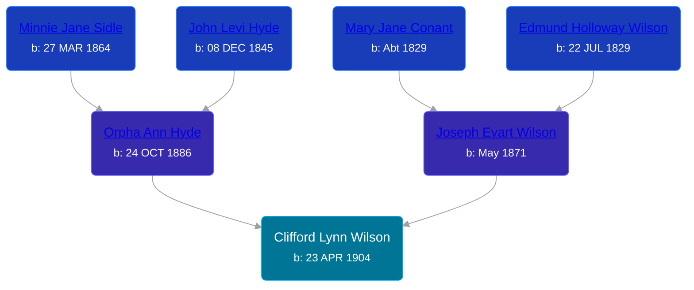

## 🔵 Clifford Lynn Wilson
<small>Age: 74y, 3m, 14d</small>

Son of [Joseph Evart Wilson](/people/5/57306025) and [Orpha Ann Hyde](/people/6/63932813)





### 📆 Events


Type | Date | Age at Event | Place
------ | ------ | ------ | ------
Birth | 23 APR 1904 |  | Tyrone Township, Kent, Michigan, USA
[Residence](#event-event-0) | 1910 | 5y, 7m, 7d | Tyrone Township, Kent, Michigan, USA
[Residence](#event-event-1) | 1930 | 25y, 7m, 7d | Grand Rapids, Kent, Michigan, United States
[Residence](#event-event-2) | 1940 | 35y, 7m, 7d | Grand Rapids, Kent, Michigan, United States
[Death](#event-event-6) | 07 AUG 1978 | 74y, 3m, 14d | East Grand Rapids, Kent, Michigan, USA
[Burial](#event-event-7) |  |  | Chapel Hill Memorial Gardens, Grand Rapids, Kent, Michigan, United States



- **Birth**
**Date**: 23 APR 1904, Age:
**Place**: Tyrone Township, Kent, Michigan, USA
- **[Residence](#event-event-0)**
**Date**: 1910, Age: 5y, 7m, 7d
**Place**: Tyrone Township, Kent, Michigan, USA
- **[Residence](#event-event-1)**
**Date**: 1930, Age: 25y, 7m, 7d
**Place**: Grand Rapids, Kent, Michigan, United States
- **[Residence](#event-event-2)**
**Date**: 1940, Age: 35y, 7m, 7d
**Place**: Grand Rapids, Kent, Michigan, United States
- **[Death](#event-event-6)**
**Date**: 07 AUG 1978, Age: 74y, 3m, 14d
**Place**: East Grand Rapids, Kent, Michigan, USA
- **[Burial](#event-event-7)**
**Date**:
**Place**: Chapel Hill Memorial Gardens, Grand Rapids, Kent, Michigan, United States


## 👩‍❤️‍👨 Relationships

### 🟣 [Dorothy M. Hopkins](/people/8/86759136), b. 27 JAN 1907

#### Events


Type | Date | Age at Event | Place
------ | ------ | ------ | ------
[Marriage](#event-family-0-event-0) | 09 JAN 1926 | 21y, 8m, 16d | Grand Rapids, Kent, Michigan, United States



- **[Marriage](#event-family-0-event-0)**
**Date**: 09 JAN 1926, Age: 21y, 8m, 16d
**Place**: Grand Rapids, Kent, Michigan, United States


#### Children With Dorothy M. Hopkins
* 🔵 [Clifford Jack Wilson](/people/4/40508928), b. 03 FEB 1930
* 🔵 [Living Person](/people/6/67314316)
### 📰 Event Sources

####  Residence, 1910
* 1910 US Census

####  Residence, 1930
* 1930 US Census

####  Residence, 1940
* 1940 US Census

####  Death, 07 AUG 1978
* Michigan Deaths, 1971-1996
>   
  > Name:  Clifford L Wilson  
  > Birth Date: 23 Apr 1904  
  > Death Date: 7 Aug 1978  
  > Gender: Male  
  > Residence: Grand Rapids, Kent, Michigan  
  > Place of Death: East Grnd Rapids, Kent, Michigan
* The Grand Rapids Press  - 7 Aug 1978
>   
  > WILSON -- Clifford L. Wilson, aged 74, of 2635 Fuller Ave. NE., passedaway early Monday morning August 7, 1978 at Blodgett Memorial MedicalCenter. He is survived by his wife, Dorothy Wilson; two sons, Clifford Jack Wilson and wife, Ardis of Rockford; Gerald L. Wilson and wife, Kay of Grand Rapids; one step son, Wilfred Brown and wife, Dorothy of Belmont; five grandchildren; two great grandchildren; one sister, Mrs.Laura Cree; two brothers, Lawrence and Fletcher Wilson; one sister-in-law, Mrs. Joseph (Ruth) Wilson all of Grand Rapids. Mr. Wilson was the founder of Wilson Trucking Service and was past president of the Travelers Protective Assoc. Services will be held at 1:00 Wednesday afternoon at the funeral chapel, with Rev. Boyd Swem of Second Congregational Church officiating. Interment Chapel Hill Memorial Gardens.
* U.S., Social Security Death Index, 1935-2014
>   
  > Name: CLIFFORD WILSON  
  > Birth: 23 Apr 1904  
  > Death: Aug 1978  
  > Last Residence: 49505 (Grand Rapids, Kent, MI)  
  > Last Benefit: (none specified)  
  > SSN: ###-##-####  
  > Issued: Michigan

####  Burial
* Chapel Hill Memorial Gardens
>   
  > Wilson, Clifford L.  
  > b: 1904; d: 1978

####  Marriage, 09 JAN 1926
* Michigan, Marriage Records, 1867-1952
>   
  > Name: Mr Clifford L Wilson  
  > Gender: Male  
  > Race: White  
  > Birth Year: abt 1905  
  > Birth Place: Kent County, Michigan  
  > Marriage Date: 9 Jan 1926  
  > Marriage Place: Grand Rapids, Kent, Michigan, USA  
  > Age: 21  
  > Residence Place: Grand Rapids  
  > Father: Joseph E Wilson  
  > Mother: Orpha A Hyde  
  > Spouse: Doris M Hopkins  
  > Gender: Female  
  > Race: White  
  > Birth Year: abt 1906  
  > Birth Place: Kalamazoo, Michigan  
  > Age: 20  
  > Residence Place: Grand Rapids  
  > Father: Melvin Hopkins  
  > Mother: Blanche Douglas  
  > County File Number: 5896  
  > State File Number: 41 18  
  > Film: 109  
  > Film Title: 41 Kent 2750  
  > Film Description: Kalkaska (1937) - Kent (1927)