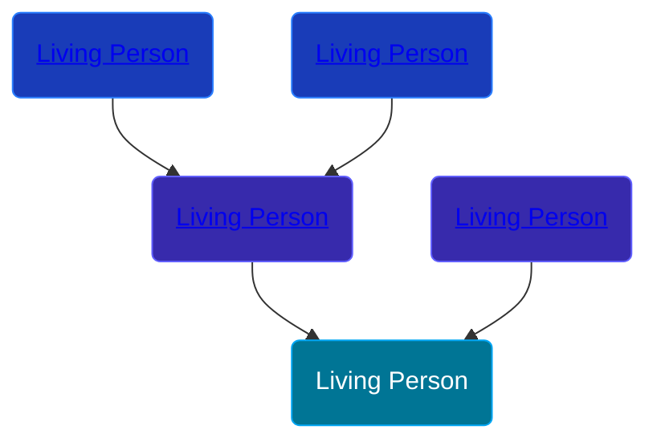

## 🔵 Living Person

Son of [Living Person](/people/1/13968890) and [Living Person](/people/4/45456538)



```mermaid
graph
classDef grands fill:#193cb8,stroke:#2b7fff,stroke-width:1px,color:#fff;
classDef parents fill:#372aac,stroke:#615fff,stroke-width:1px,color:#fff;
classDef primary fill:#007595,stroke:#00a6f4,stroke-width:1px,color:#fff;
42256024(Living Person):::primary
45456538(<a class="text-white" href="/people/4/45456538">Living Person</a>):::parents-->42256024
72063628(<a class="text-white" href="/people/7/72063628">Living Person</a>):::grands-->45456538
21284059(<a class="text-white" href="/people/2/21284059">Living Person</a>):::grands-->45456538
13968890(<a class="text-white" href="/people/1/13968890">Living Person</a>):::parents-->42256024
```

