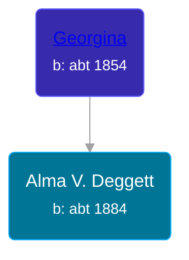

## 🟣 Alma V. Deggett

Daughter of [Georgina ](/people/2/20682980)





### 📆 Events


Type | Date | Age at Event | Place
------ | ------ | ------ | ------
Birth | abt 1884 |  | Michigan, USA
[Residence](#event-event-0) | 07 MAY 1910 | 26y, 5m, 7d |
[Residence](#event-event-1) | 21 JAN 1920 | 36y, 1m, 21d | Somerset Township, Hillsdale, Michigan, USA
[Residence](#event-event-2) | 10 APR 1940 | 56y, 4m, 10d | Napolean, Jackson, Michigan, USA



- **Birth**
**Date**: abt 1884, Age:
**Place**: Michigan, USA
- **[Residence](#event-event-0)**
**Date**: 07 MAY 1910, Age: 26y, 5m, 7d
**Place**:
- **[Residence](#event-event-1)**
**Date**: 21 JAN 1920, Age: 36y, 1m, 21d
**Place**: Somerset Township, Hillsdale, Michigan, USA
- **[Residence](#event-event-2)**
**Date**: 10 APR 1940, Age: 56y, 4m, 10d
**Place**: Napolean, Jackson, Michigan, USA


## 👩‍❤️‍👨 Relationships

### 🔵 [Ira M. Touse](/people/4/43588740), b. abt 1880

#### Children With Ira M. Touse
* 🔵 [Willis I. Touse](/people/2/2062152), b. about 1905
* 🟣 [Greeta Bell Touse](/people/6/61135838), b. 20 DEC 1906
### 📰 Event Sources

####  Residence, 07 MAY 1910
* 1910 US Census
>
  > Name: Alma V Touse
  > Alternate Name: Alma V Louse
  > Age in 1910: 26
  > Birth Date: 1884
  > Birthplace: Michigan
  > Home in 1910: Somerset, Hillsdale, Michigan, USA
  > Sheet Number: 11a
  > Race: White
  > Gender: Female
  > Relation to Head of House: Wife
  > Marital Status: Married
  > Father's Birthplace: Wisconsin
  > Mother's Birthplace: Michigan
  > Native Tongue: English
  > Able to Read: Y
  > Able to Write: Y
  > Enumeration District Number: 0117
  > Years Married: 8
  > Number of Children Born: 3
  > Number of Children Living: 2
  > Enumerated Year: 1910
  >
  > Household members:
  > Ira Touse, 30
  > Alma V Touse, 26
  > Wills I Touse, 5
  > Gretta B Touse, 3

####  Residence, 21 JAN 1920
* 1920 US Census
>
  > Name: Elma V Fouse
  > Age: 36
  > Birth Year: abt 1884
  > Birthplace: Michigan
  > Home in 1920: Somerset, Hillsdale, Michigan
  > Residence Date: 1920
  > Race: White
  > Gender: Female
  > Relation to Head of House: Wife
  > Marital Status: Married
  > Spouse's Name: Ira M Fouse
  > Father's Birthplace: Wisconsin
  > Mother's Name: Georgina Daggett
  > Mother's Birthplace: Michigan
  > Able to Speak English: Yes
  > Able to Read: Yes
  > Able to Write: Yes
  >
  > Household members:
  > Ira M Fouse, 40
  > Elma V Fouse, 36
  > Willo I Fouse, 14
  > Greta B Fouse, 13
  > Georgina Daggett, 66

####  Residence, 10 APR 1940
* 1940 US Census
>
  > Name: Alma V Touse
  > Respondent: Yes
  > Age: 56
  > Estimated Birth Year: abt 1884
  > Gender: Female
  > Race: White
  > Birthplace: Michigan
  > Marital Status: Married
  > Relation to Head of House: Wife
  > Home in 1940: Napoleon, Jackson, Michigan
  > Street: Cranbering Lake Road
  > Inferred Residence in 1935: Rural
  > Residence in 1935: Rural
  > Resident on Farm in 1935: Yes
  > Sheet Number: 6A
  > Attended School or College: No
  > Highest Grade Completed: Elementary school, 7th grade
  > Weeks Worked in 1939: 0
  > Income: 0
  > Income Other Sources: No
  >
  > Household Members
  > Ira M Touse, 60, Head
  > Alma V Touse, 56, Wife
  > Milton W Rutan, 38, Son-in-law
  > Grata D Rutan, 33, Daughter
  > Paul R Rutan, 12, Grandson
  > Louis W Rutan, 11, Grandson
  > L Earl S Rutan, 7, Grandson
  > Florence J Rutan, 5, Granddaughter
  > Gayl A Rutan, 3, Granddaughter
  > Mary L Rutan, 1, Granddaughter

