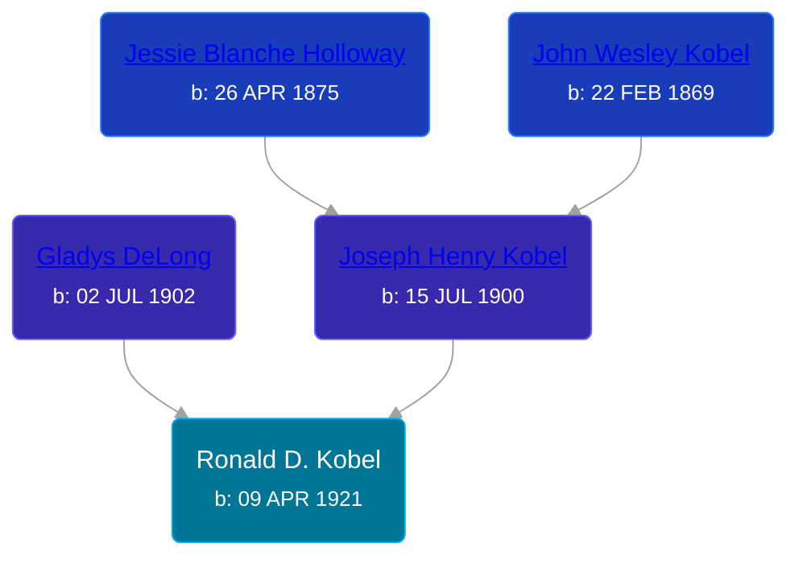

## 🔵 Ronald D. Kobel
<small>Age: 79y, 9m, 21d</small>

Son of [Joseph Henry Kobel](/people/5/50400728) and [Gladys DeLong](/people/9/96793928)





### 📆 Events


Type | Date | Age at Event | Place
------ | ------ | ------ | ------
[Birth](#event-event-2) | 09 APR 1921 |  | Michigan, USA
[Residence](#event-event-0) | 1930 | 8y, 7m, 21d | Grand Rapids, Kent, Michigan, United States
[Death](#event-event-4) | 30 JAN 2001 | 79y, 9m, 21d | Kent, Michigan, USA



- **[Birth](#event-event-2)**
**Date**: 09 APR 1921, Age:
**Place**: Michigan, USA
- **[Residence](#event-event-0)**
**Date**: 1930, Age: 8y, 7m, 21d
**Place**: Grand Rapids, Kent, Michigan, United States
- **[Death](#event-event-4)**
**Date**: 30 JAN 2001, Age: 79y, 9m, 21d
**Place**: Kent, Michigan, USA


## 👩‍❤️‍👨 Relationships

### 🟣 [Doris L. Hutchinson](/people/3/36141248), b. 24 SEP 1925

### 📰 Event Sources

####  Birth, 09 APR 1921
* Ron Wilson's Research

####  Residence, 1930
* 1930 US Census

####  Death, 30 JAN 2001
* Kent County, Michigan Death Certificates  - 250395