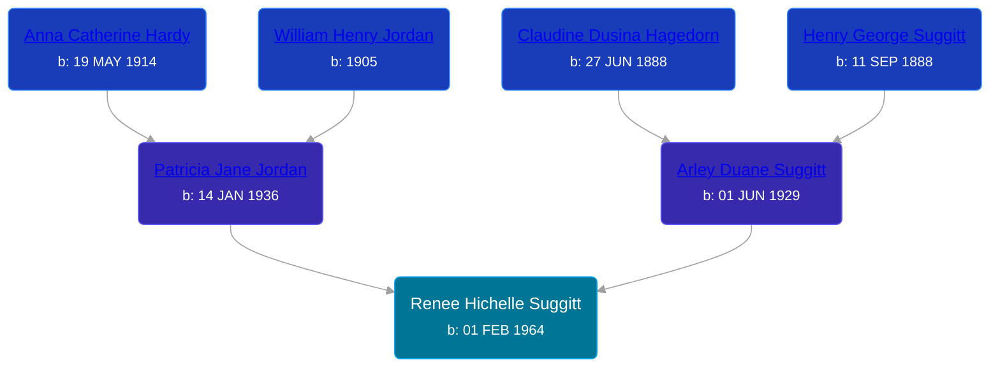

## 🟣 Renee Hichelle Suggitt
<small>Age: 24y, 22d</small>

Daughter of [Arley Duane Suggitt](/people/9/91694885) and [Patricia Jane Jordan](/people/8/8578400)





### 📆 Events


Type | Date | Age at Event | Place
------ | ------ | ------ | ------
Birth | 01 FEB 1964 |  |
Death | 23 FEB 1988 | 24y, 22d |
[Burial](#event-event-4) |  |  | Calvary Cemetery, Sioux City, Woodbury, Iowa, USA



- **Birth**
**Date**: 01 FEB 1964, Age:
**Place**:
- **Death**
**Date**: 23 FEB 1988, Age: 24y, 22d
**Place**:
- **[Burial](#event-event-4)**
**Date**:
**Place**: Calvary Cemetery, Sioux City, Woodbury, Iowa, USA


### 📰 Event Sources

####  Burial
* findagrave.com
