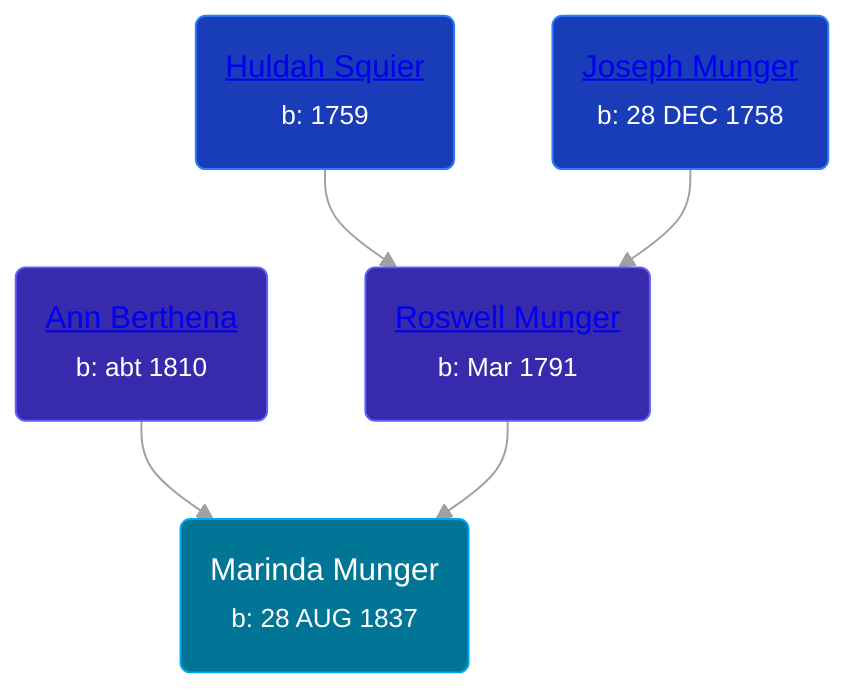

## 🟣 Marinda Munger
<small>Age: 75y, 5m, 7d</small>

Daughter of [Roswell Munger](/people/2/21686617) and [Ann Berthena ](/people/9/91501676)





### 📆 Events


Type | Date | Age at Event | Place
------ | ------ | ------ | ------
[Birth](#event-event-2) | 28 AUG 1837 |  |
[Residence](#event-event-0) | 1850 | 12y, 3m, 2d | LaGrange, Lorain, Ohio, USA
[Residence](#event-event-1) | 1860 | 22y, 3m, 2d | LaGrange, Lorain, Ohio, USA
[Death](#event-event-5) | 05 FEB 1913 | 75y, 5m, 7d | Grand Rapids, Kent, Michigan, United States



- **[Birth](#event-event-2)**
**Date**: 28 AUG 1837, Age:
**Place**:
- **[Residence](#event-event-0)**
**Date**: 1850, Age: 12y, 3m, 2d
**Place**: LaGrange, Lorain, Ohio, USA
- **[Residence](#event-event-1)**
**Date**: 1860, Age: 22y, 3m, 2d
**Place**: LaGrange, Lorain, Ohio, USA
- **[Death](#event-event-5)**
**Date**: 05 FEB 1913, Age: 75y, 5m, 7d
**Place**: Grand Rapids, Kent, Michigan, United States


### 📰 Event Sources

####  Birth, 28 AUG 1837
* History of Kent County, Michigan  - 628

####  Residence, 1850
* 1850 US Census

####  Residence, 1860
* 1860 US Census

####  Death, 05 FEB 1913
* Michigan, Death Records, 1867-1950
>   
  > Name:Mirenda Pysher [Mirenda Munger]   
  > Gender: Female  
  > Age: 76  
  > Race: White  
  > Birth Year: 1836  
  > Death Date: 5 Feb 1913  
  > Death Place: Grand Rapids, Kent, Michigan, USA  
  > Father: Roswell Munger