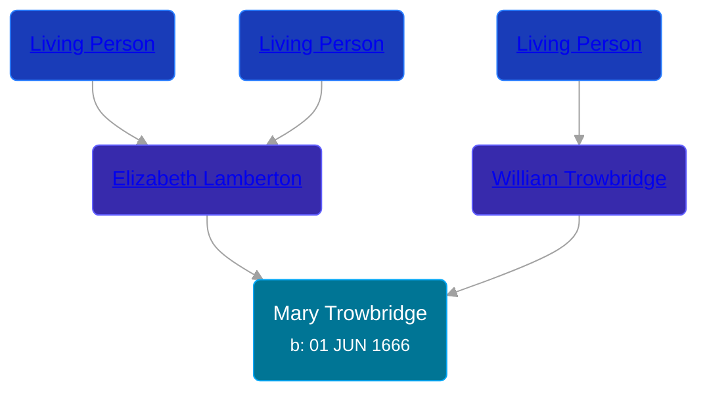

## 🟣 Mary Trowbridge

Daughter of [William Trowbridge](/people/5/57269298) and [Elizabeth Lamberton](/people/3/33832688)





### 📆 Events


Type | Date | Age at Event | Place
------ | ------ | ------ | ------
Birth | 01 JUN 1666 |  | New Haven, New Haven, Connecticut, USA



- **Birth**
**Date**: 01 JUN 1666, Age:
**Place**: New Haven, New Haven, Connecticut, USA


## 👩‍❤️‍👨 Relationships

### 🔵 [Joseph Goodwin](/people/3/39421908)

#### Children With Joseph Goodwin
* 🟣 [Mary Goodwin](/people/4/49404198), b. 14 JAN 1699