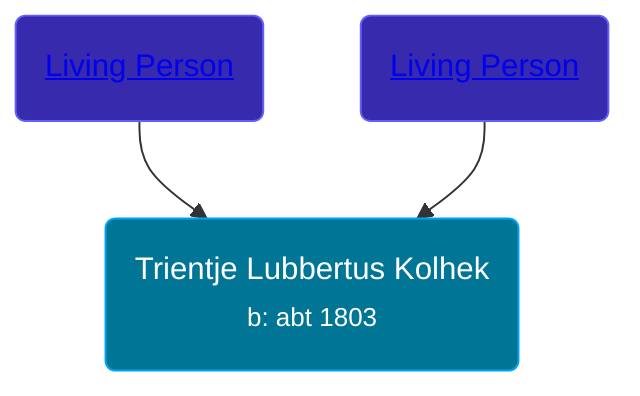

## 🟣 Trientje Lubbertus Kolhek

Daughter of [Living Person](/people/1/10319488) and [Living Person](/people/7/76207168)





### 📆 Events


Type | Date | Age at Event | Place
------ | ------ | ------ | ------
[Birth](#event-event-3) | abt 1803 |  | Hoogezand, Netherlands



- **[Birth](#event-event-3)**
**Date**: abt 1803, Age:
**Place**: Hoogezand, Netherlands


## 👩‍❤️‍👨 Relationships

### 🔵 [Tidde Freerks Olthof](/people/7/7481187), b. 29 AUG 1790

#### Events


Type | Date | Age at Event | Place
------ | ------ | ------ | ------
Marriage | 1844 | 41y |



- **Marriage**
**Date**: 1844, Age: 41y
**Place**:


### 📰 Event Sources

####  Birth, abt 1803
* Dutch Civil Register
>   
  > Source Civil register - Marriage  
  > Archive location: Groninger Archieven  
  > General Municipality: Loppersum  
  > Type of record: Huwelijksakte  
  > Record number: 15  
  > Registration date: 22-06-1844  
  > Bridegroom: Tidde Freerks Olthof  
  > Place of birth: Loppersum  
  > Bride: Trientje Lubbertus Kolhek  
  > Place of birth: Hoogezand  
  > Father bridegroom: Freerk Tiddes Olthof  
  > Mother bridegroom: IJda Egberts  
  > Father bride: Lubbertus Jans Kolhek  
  > Mother bride: Grietje Harms  
  > Additional information: beroep vader bruid: dagloner; bruidegom 53 jaar; bruid 41 jaar; weduwnaar van Aalke Pieters Dijkema
####  Marriage, 1844
