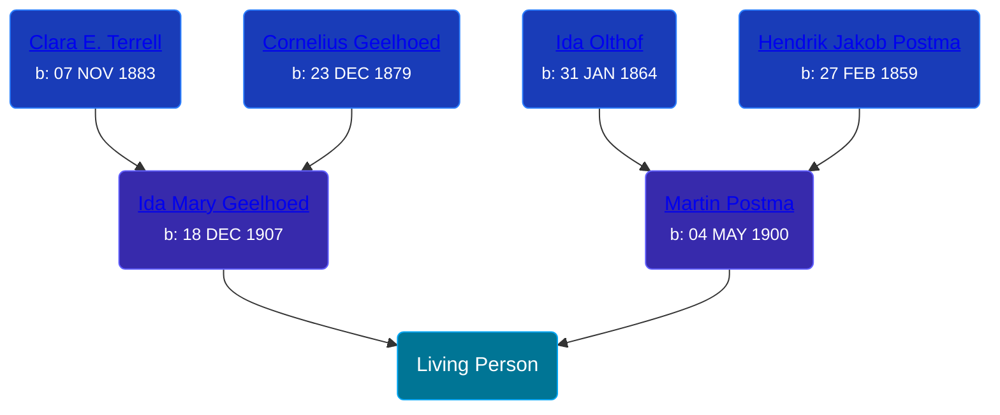

## üîµ Living Person

Son of [Martin Postma](/people/7/7474832) and [Ida Mary Geelhoed](/people/1/11612484)



```mermaid
graph
classDef grands fill:#193cb8,stroke:#2b7fff,stroke-width:1px,color:#fff;
classDef parents fill:#372aac,stroke:#615fff,stroke-width:1px,color:#fff;
classDef primary fill:#007595,stroke:#00a6f4,stroke-width:1px,color:#fff;
42765268(Living Person):::primary
11612484(<a class="text-white" href="/people/1/11612484">Ida Mary Geelhoed</a><br /><small>b: 18 DEC 1907</small>):::parents-->42765268
62490094(<a class="text-white" href="/people/6/62490094">Clara E. Terrell</a><br /><small>b: 07 NOV 1883</small>):::grands-->11612484
92844960(<a class="text-white" href="/people/9/92844960">Cornelius Geelhoed</a><br /><small>b: 23 DEC 1879</small>):::grands-->11612484
7474832(<a class="text-white" href="/people/7/7474832">Martin Postma</a><br /><small>b: 04 MAY 1900</small>):::parents-->42765268
60020862(<a class="text-white" href="/people/6/60020862">Ida Olthof</a><br /><small>b: 31 JAN 1864</small>):::grands-->7474832
31727152(<a class="text-white" href="/people/3/31727152">Hendrik Jakob Postma</a><br /><small>b: 27 FEB 1859</small>):::grands-->7474832
```


## 👩‍❤️‍👨 Relationships

### 🟣 [Living Person](/people/3/36781443)
