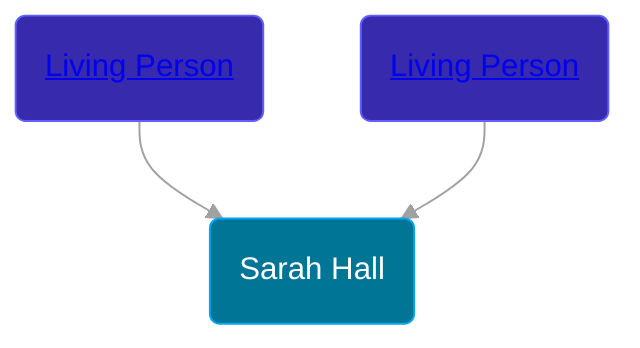

## 🟣 Sarah Hall
<small>Age: undefined</small>

Daughter of [Living Person](/people/2/20440074) and [Living Person](/people/9/9595591)





### 📆 Events


Type | Date | Age at Event | Place
------ | ------ | ------ | ------
[Death](#event-event-3) | 31 JAN 1689 | undefined |



- **[Death](#event-event-3)**
**Date**: 31 JAN 1689, Age: undefined
**Place**:


## 👩‍❤️‍👨 Relationships

### 🔵 [Nicholas Munger](/people/4/40603656), b. abt 1630

#### Events


Type | Date | Age at Event | Place
------ | ------ | ------ | ------
[Marriage](#event-family-0-event-0) | 02 JUN 1659 | undefined | Guilford, Connecticut, USA



- **[Marriage](#event-family-0-event-0)**
**Date**: 02 JUN 1659, Age: undefined
**Place**: Guilford, Connecticut, USA


#### Children With Nicholas Munger
* 🔵 [John Munger](/people/5/5748706), b. 26 APR 1660
* 🔵 [Samuel Munger](/people/5/57362828), b. abt 1665
### 📰 Event Sources

####  Marriage, 02 JUN 1659
* The Munger Book  - xvi
* A Modern History of New Haven and Eastern New Haven County  - 682
* Families of Early Guilford, Connecticut, Vol. II  - 833
####  Death, 31 JAN 1689
* The Munger Book  - xvi
