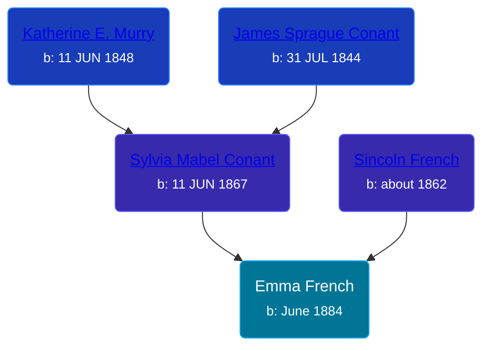

## 🟣 Emma French

Daughter of [Sincoln French](/people/6/69338120) and [Sylvia Mabel Conant](/people/8/88275832)





### 📆 Events


Type | Date | Age at Event | Place
------ | ------ | ------ | ------
Birth | June 1884 |  | Michigan, USA
[Residence](#event-event-0) | 1900 | 15y, 6m | Robinson Township, Ottawa, Michigan, USA



- **Birth**
**Date**: June 1884, Age:
**Place**: Michigan, USA
- **[Residence](#event-event-0)**
**Date**: 1900, Age: 15y, 6m
**Place**: Robinson Township, Ottawa, Michigan, USA


### 📰 Event Sources

####  Residence, 1900
* 1900 US Census
