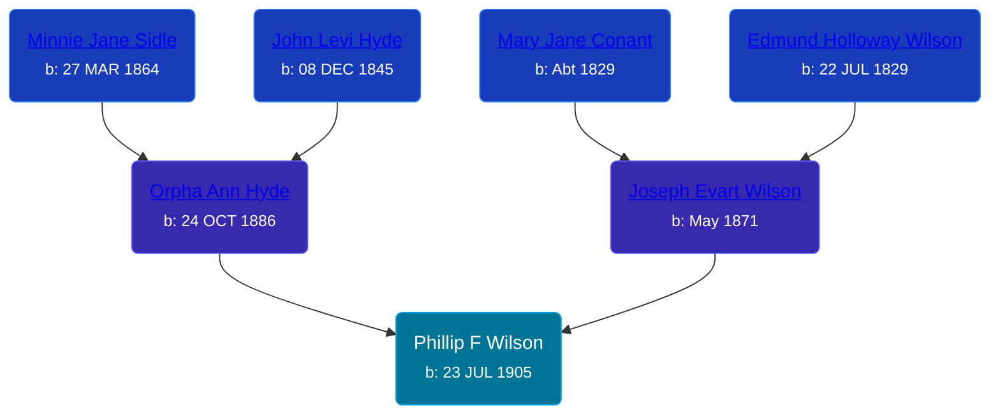

## 🔵 Phillip F Wilson

Son of [Joseph Evart Wilson](/people/5/57306025) and [Orpha Ann Hyde](/people/6/63932813)





### 📆 Events


Type | Date | Age at Event | Place
------ | ------ | ------ | ------
[Birth](#event-event-2) | 23 JUL 1905 |  | Tyrone Township, Kent, Michigan, USA



- **[Birth](#event-event-2)**
**Date**: 23 JUL 1905, Age:
**Place**: Tyrone Township, Kent, Michigan, USA


### 📰 Event Sources

####  Birth, 23 JUL 1905
* Michigan, U.S., Birth Records, 1867-1914
>   
  > Name: Phillip F. Wilson  
  > Gender: Male  
  > Race: White  
  > Birth Date: 23 Jul 1905  
  > Birth Place: Tyron Township, Michigan, USA  
  > Father: Joseph Wilson  
  > Mother: Orpha Wilson  
  > Jurisdiction Number: 3074  
  > Reference Number:  
  >