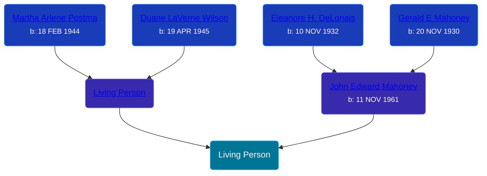

## 🔵 Living Person

Son of [John Edward Mahoney](/people/2/20318131) and [Living Person](/people/9/92555368)





## 👩‍❤️‍👨 Relationships

### 🟣 [Living Person](/people/5/56446490)

#### Children With Living Person
* 🟣 [Living Person](/people/7/70456546)
* 🟣 [Living Person](/people/7/71737208)