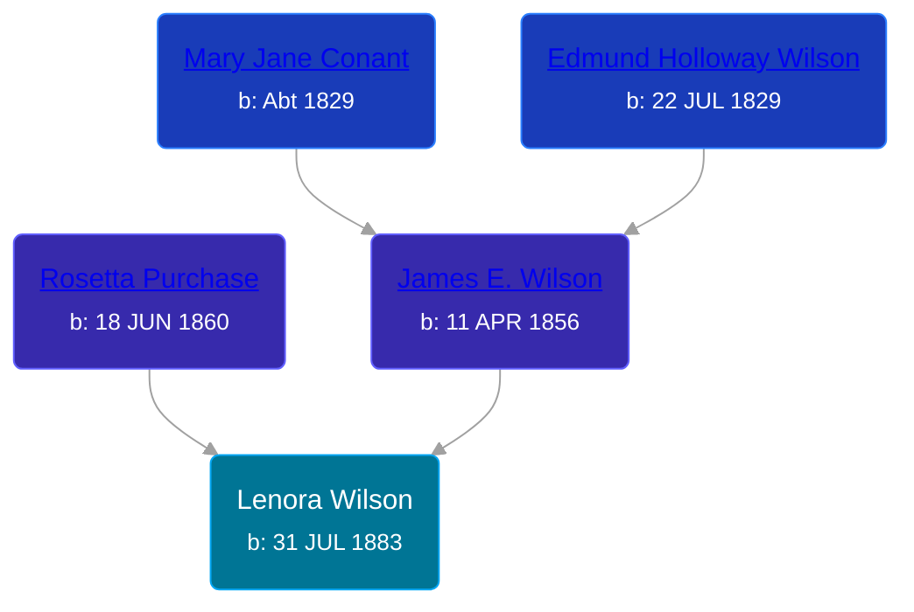

## 🟣 Lenora Wilson
<small>Age: 54y, 1m, 1d</small>

Daughter of [James E. Wilson](/people/5/54950695) and [Rosetta Purchase](/people/2/27770192)





### 📆 Events


Type | Date | Age at Event | Place
------ | ------ | ------ | ------
Birth | 31 JUL 1883 |  | Robinson Township, Ottawa, Michigan, USA
[Death](#event-event-3) | 02 SEP 1937 | 54y, 1m, 1d | Grand Rapids, Kent, Michigan, United States



- **Birth**
**Date**: 31 JUL 1883, Age:
**Place**: Robinson Township, Ottawa, Michigan, USA
- **[Death](#event-event-3)**
**Date**: 02 SEP 1937, Age: 54y, 1m, 1d
**Place**: Grand Rapids, Kent, Michigan, United States


## 👩‍❤️‍👨 Relationships

### 🔵 [William Stephan](/people/9/92160924), b. about 1896

#### Events


Type | Date | Age at Event | Place
------ | ------ | ------ | ------
[Marriage](#event-family-0-event-0) | 17 APR 1920 | 36y, 8m, 16d | Grand Rapids, Kent, Michigan, United States



- **[Marriage](#event-family-0-event-0)**
**Date**: 17 APR 1920, Age: 36y, 8m, 16d
**Place**: Grand Rapids, Kent, Michigan, United States


### 📰 Event Sources

####  Marriage, 17 APR 1920
* Michigan, Marriage Records, 1867-1952
>   
  > Name:Wm Stephan  
  > Gender:Male  
  > Race:White  
  > Birth Year:abt 1896  
  > Birth Place:Charlevoix, Michigan  
  > Marriage Date:17 Apr 1920  
  > Marriage Place:Grand Rapids, Kent, Michigan, USA  
  > Age:24  
  > Residence Place:Grand Rapids  
  > Father:Wm Stephan  
  > Mother:Emeley Poole  
  > Spouse:Lenora Wilson  
  > Gender:Female  
  > Race:White  
  > Birth Year:abt 1890  
  > Birth Place:Robertson, Michigan  
  > Age:30  
  > Residence Place:Grand Rapids  
  > Father:James Wilson  
  > Mother:Rosetta Purchase  
  > Record Number:10350  
  > Film:150  
  > Film Description:1920 Gogebic - 1920 Kent

####  Death, 02 SEP 1937
* Michigan, Death Records, 1867-1950
>   
  > Name:Mrs Lenora Wilson Pickard  
  > Gender:Female  
  > Marital Status:Married  
  > Birth Date:Jul, 1883  
  > Birth Place:Ottawa County, Michigan  
  > Death Date:2 Sep 1937  
  > Death Place:Grand Rapids, Kent, Michigan, USA  
  > Death Age:54  
  > File Number:027708  
  > Father:James Wilson  
  > Mother:Rosetta Pruchase  
  > Husband: Owen Pickard